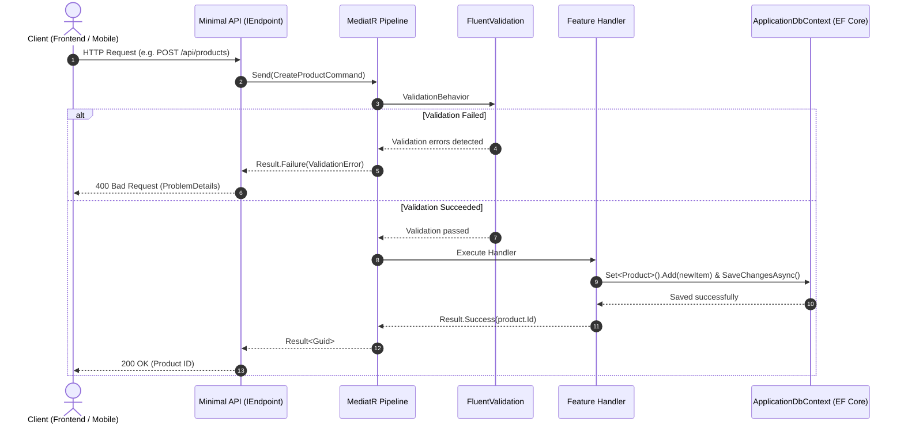

# 🏛️ Clean Showcase & Pragmatic DDD Starter Template (.NET 10)

A modern, lightweight, **zero-bloat starter template** built with the latest **.NET 10** and **C# 14** standards. Specifically engineered as a fast, maintainable, and production-ready foundation for building high-performance Web APIs.

---

## 🎯 1. Architectural Philosophy: Why this design?

Most Clean Showcase templates suffer from two major problems:

1. **Over-Engineering & Pre-Mature Bloat:** Enforcing unnecessary abstractions, heavy generic repositories, mandatory auditing, complex domain events, or excessive time abstractions that add friction and maintenance burden to small and medium projects.
2. **Scattered Responsibilities & Weak Organization:** Leaking data access code into controllers, or throwing expensive exceptions for normal business logic failures, hurting performance and making code hard to trace.

### Core Principles of this Template:

- **YAGNI (You Aren't Gonna Need It):** Zero redundant code or abstractions. The template contains only the essential 100% common building blocks across projects. Any extra features (auditing, auth, caching) are added incrementally when needed.
- **Zero Third-Party Bloat in Core:** The `Domain` layer is 100% pure C# with no third-party package dependencies.
- **Result Pattern instead of Throwing Exceptions:** Explicit and fast control flow for business errors without the CPU overhead of stack-trace unwinding.
- **Self-Discovering Minimal APIs:** Keeps `Program.cs` clean and maintainable by structuring endpoints into dedicated, auto-registered classes.

---

## 🛡️ 2. Strict Dependency Matrix

The architecture strictly enforces inward-only dependencies:

```text
┌─────────────────────────────────────────────────────────────┐
│                      Showcase.Api                       │
└───────────────┬─────────────────────────────┬───────────────┘
                │                             │
                ▼                             ▼
┌──────────────────────────────┐ ┌────────────────────────────┐
│   Showcase.Application   │ │ Showcase.Infrastructure│
└───────────────┬──────────────┘ └────────────┬───────────────┘
                │                             │
                ▼                             ▼
┌─────────────────────────────────────────────────────────────┐
│                     Showcase.Domain                     │
│                 (Pure C# - Zero Dependencies)               │
└─────────────────────────────────────────────────────────────┘
```

- **`Domain`:** Core business entities and logic; has zero external references or dependencies.
- **`Application`:** Depends only on `Domain`. Never imports Infrastructure or Api code.
- **`Infrastructure`:** Implements `Application` interfaces and accesses `Domain`.
- **`Api`:** Composition root; wires up Dependency Injection and configures the HTTP request pipeline.

> ⚠️ **Architectural Rule:** Any code violating this directional flow (e.g., Application depending directly on Infrastructure) is strictly rejected.

---

## 📂 3. Project Structure

```text
Showcase/
│
├── Directory.Build.props                              // Centralized .NET 10 build configuration
├── Rename-Project.ps1                                 // Automated solution & project rename script
├── Showcase.slnx                                  // Modern solution file format
│
├── Showcase.Domain/                               // Pure business core
│   ├── Common/
│   │   ├── BaseEntity/
│   │   │   └── BaseEntity.cs                          // Base entity with Guid identifier
│   │   └── Results/
│   │       ├── ErrorType.cs                           // Enum of error categories (NotFound, Validation, etc.)
│   │       ├── Error.cs                               // Immutable Error record with factory methods
│   │       └── Result.cs                              // Result and Result<TValue> with implicit operators
│   ├── Entities/                                      // Business domain entities
│   └── Enums/                                         // Domain-specific enumerations
│
├── Showcase.Application/                          // Use cases & application logic
│   ├── Common/
│   │   ├── Behaviors/
│   │   │   ├── ValidationBehavior.cs                  // Automatic FluentValidation pipeline via MediatR
│   │   │   └── LoggingBehavior.cs                     // Request performance & execution time logger
│   │   ├── Interfaces/
│   │   │   └── IApplicationDbContext.cs               // EF Core abstraction (DbSet access & SaveChanges)
│   │   ├── Models/
│   │   │   └── PaginatedList.cs                       // Reusable pagination model
│   │   └── DependencyInjection/
│   │       └── DependencyInjection.cs                 // MediatR & FluentValidation auto-registration
│   └── Features/                                      // Feature modules (Vertical Slices)
│
├── Showcase.Infrastructure/                       // Database, persistence & technical services
│   ├── Data/
│   │   ├── ApplicationDbContext.cs                    // EF Core DbContext
│   │   └── Configurations/                            // EntityTypeConfigurations & Fluent API mappings
│   └── DependencyInjection/
│       └── DependencyInjection.cs                     // DbContext & Connection String configuration
│
└── Showcase.Api/                                  // HTTP entry point & Minimal APIs
    ├── Common/
    │   ├── Errors/
    │   │   └── GlobalExceptionHandler.cs              // Unhandled exception handler (RFC 7807 ProblemDetails)
    │   └── Results/
    │       └── ResultExtensions.cs                    // Type-safe Result to HTTP response mapping
    ├── Endpoints/
    │   ├── IEndpoint.cs                               // Standard Minimal API endpoint contract
    │   └── EndpointExtensions.cs                      // Auto-registration via app.MapEndpoints()
    ├── DependencyInjection/
    │   └── DependencyInjection.cs                     // Swagger, CORS, and Endpoint services
    ├── appsettings.json                               // Configuration settings & connection strings
    └── Program.cs                                     // HTTP request pipeline setup
```

---

## ⚙️ 4. How Each Layer Works

### 1. Domain Layer (`Showcase.Domain`)

- **`BaseEntity.cs`:**
  - Enforces a uniform `Guid Id` for all entities in the system, automatically generated via `Guid.NewGuid()`.
- **`ErrorType.cs` & `Error.cs`:**
  - `ErrorType` enum defines distinct categories: `Failure`, `Validation`, `NotFound`, `Conflict`, `Unauthorized`, `Forbidden`.
  - `Error` record contains `Code`, `Description`, and `Type`. Factory methods like `Error.NotFound()` make instantiating errors simple and type-safe.
- **`Result.cs` & `Result<TValue>`:**
  - Encapsulates success or failure without throwing exceptions.
  - Implicit operators allow direct and expressive returns:
    ```csharp
    return product;                // Implicit conversion to Result.Success(product)
    return ProductErrors.NotFound; // Implicit conversion to Result.Failure(error)
    ```

### 2. Application Layer (`Showcase.Application`)

- **`ValidationBehavior.cs`:**
  - A MediatR pipeline behavior that automatically intercepts requests before they reach the handler.
  - If an `AbstractValidator<TRequest>` exists and validation fails, the pipeline halts immediately and returns `Result.Failure(ValidationError)` directly—no handler execution and no exception overhead.
- **`LoggingBehavior.cs`:**
  - Uses `Stopwatch` to track and log execution duration in milliseconds for every command and query.
- **`IApplicationDbContext.cs`:**
  - Exposes `DbSet<TEntity> Set<TEntity>()` and `SaveChangesAsync(CancellationToken)` for decoupled data access.
- **`Features/` (Vertical Slice Structure):**
  - Keeps command, handler, and validator together inside a feature folder for high cohesion and rapid maintainability.

### 3. Infrastructure Layer (`Showcase.Infrastructure`)

- **`ApplicationDbContext.cs`:**
  - Implements `IApplicationDbContext`.
  - Automatically loads all entity configurations from the assembly:
    ```csharp
    modelBuilder.ApplyConfigurationsFromAssembly(typeof(ApplicationDbContext).Assembly);
    ```

### 4. API Layer (`Showcase.Api`)

- **`IEndpoint` & `EndpointExtensions.cs`:**
  - Each endpoint is encapsulated in its own class implementing `IEndpoint`.
  - During application startup, `app.MapEndpoints()` scans the assembly and registers all endpoints automatically.
- **`ResultExtensions.cs`:**
  - Converts domain `Result` objects into standard RFC 7807 `ProblemDetails` responses. Automatically maps `ErrorType.NotFound` to `404`, `ErrorType.Conflict` to `409`, `ErrorType.Validation` to `400`, etc.
- **`GlobalExceptionHandler.cs`:**
  - Implements ASP.NET Core's `IExceptionHandler` to capture unhandled server crashes and return safe `500 Internal Server Error` responses without leaking stack traces.

---

## 🔄 5. Request Lifecycle Flow



---

## 🚀 6. Quick Start: Build a Feature in 4 Steps

To implement a new feature (e.g., `CreateProduct`), follow these 4 steps:

### 1. In Domain (`Showcase.Domain/Entities/Product.cs`):

```csharp
public class Product : BaseEntity
{
    public string Name { get; private set; }
    public decimal Price { get; private set; }

    public Product(string name, decimal price)
    {
        Name = name;
        Price = price;
    }
}
```

### 2. In Infrastructure (`Showcase.Infrastructure/Data/Configurations/ProductConfiguration.cs`):

```csharp
public class ProductConfiguration : IEntityTypeConfiguration<Product>
{
    public void Configure(EntityTypeBuilder<Product> builder)
    {
        builder.HasKey(p => p.Id);
        builder.Property(p => p.Name).HasMaxLength(100).IsRequired();
        builder.Property(p => p.Price).HasPrecision(18, 2);
    }
}
```

### 3. In Application (`Showcase.Application/Features/Products/CreateProduct/`):

- **The Command:**

  ```csharp
  public record CreateProductCommand(string Name, decimal Price) : IRequest<Result<Guid>>;
  ```

- **The Validator:**

  ```csharp
  public class CreateProductValidator : AbstractValidator<CreateProductCommand>
  {
      public CreateProductValidator()
      {
          RuleFor(x => x.Name).NotEmpty().MaximumLength(100);
          RuleFor(x => x.Price).GreaterThan(0);
      }
  }
  ```

- **The Handler:**
  ```csharp
  public class CreateProductHandler(IApplicationDbContext context)
      : IRequestHandler<CreateProductCommand, Result<Guid>>
  {
      public async Task<Result<Guid>> Handle(CreateProductCommand request, CancellationToken ct)
      {
          var product = new Product(request.Name, request.Price);
          context.Set<Product>().Add(product);
          await context.SaveChangesAsync(ct);
          return product.Id; // Implicit conversion to Result.Success
      }
  }
  ```

### 4. In API (`Showcase.Api/Endpoints/Products/CreateProductEndpoint.cs`):

```csharp
public class CreateProductEndpoint : IEndpoint
{
    public void MapEndpoint(IEndpointRouteBuilder app)
    {
        app.MapPost("/api/products", async (CreateProductCommand command, ISender sender) =>
        {
            var result = await sender.Send(command);
            return result.ToResponse(); // Returns 200 with ID, or 400 ProblemDetails
        }).WithTags("Products");
    }
}
```

**That's it! No changes to `Program.cs` or service registration required.**

---

## 🏷️ 7. Renaming the Template

To rename this template for a new project, run the included PowerShell script from the solution root:

```powershell
.\Rename-Project.ps1 -NewName "YourProjectName"
```

### What this script does automatically:

1. Cleans temporary `bin` and `obj` build directories.
2. Updates namespaces, usings, and project references across all files (`.cs`, `.csproj`, `.slnx`, `.json`, `.http`, `.md`).
3. Renames all project and solution files.
4. Renames all project directories.
5. Verifies the solution with `dotnet build`.
6. Self-deletes upon successful completion to leave your project clean.

---

## 🛠️ 8. Tech Stack & Packages

- **Target Framework:** [.NET 10](https://dotnet.microsoft.com/) / C# 14
- **Mediator & CQRS:** [MediatR](https://github.com/jbogard/MediatR) (v14.2.0)
- **Validation:** [FluentValidation](https://fluentvalidation.net/) (v12.1.1)
- **ORM & Database:** [Entity Framework Core](https://learn.microsoft.com/en-us/ef/core/) (v10.0.12) with SQL Server
- **API Documentation:** [OpenAPI & Swagger UI](https://learn.microsoft.com/en-us/aspnet/core/fundamentals/openapi/aspnetcore-openapi)
