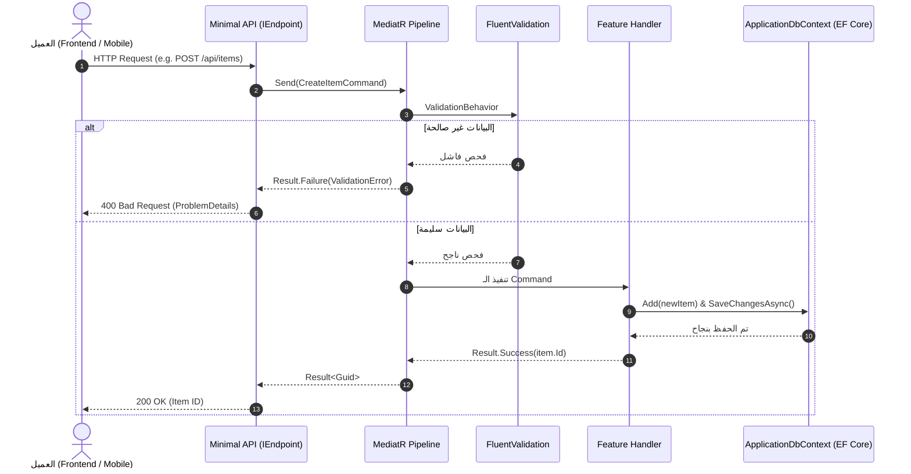

# 🏛️ Clean Architecture & Pragmatic DDD Starter Template (.NET 10)

قالب معماري حديث، نظيف، وفائق الخفة (Zero-Bloat Starter Template) مبني بأحدث معايير **.NET 10** و **C# 14**، مصمم خصيصاً ليكون نقطة انطلاق سريعة وقابلة لإعادة الاستخدام في بناء الـ Web APIs القوية والجاهزة للإنتاج.

---

## 🎯 1. فلسفة المعمارية: ليش انعملت بهذا الشكل؟

أغلب قوالب الـ Clean Architecture المنتشرة تعاني من مشكلتين أساسيتين:

1. **التعقيد الزائد والحشو المسبق (Over-Engineering & Bloat):** يتم فرض حزم، وأنماط معقدة (مثل Generic Repositories، أو Auditing إجباري، أو Domain Events، أو Time Abstractions) تستهلك وقتاً في الصيانة وتعيق المشاريع البسيطة والمتوسطة.
2. **خلط المسؤوليات وضعف التنظيم:** وضع كود الوصول للبيانات داخل الـ Controllers، أو رمي استثناءات (Exceptions) لأخطاء منطق العمل العادية، مما يبطئ الأداء ويصعب تتبع الكود.

### المبادئ التي بُني عليها هذا القالب:

- **YAGNI (You Aren't Gonna Need It):** لا يوجد أي سطر كود أو تجريد (Abstraction) زائد. القالب يحتوي فقط على الأساسيات المشتركة 100% بين كل المشاريع، وأي ميزة إضافية (كالتدقيق الزمني أو المصادقة) تضاف عند الحاجة فقط.
- **Zero Third-Party Bloat في النواة:** طبقة الـ `Domain` تمثل C# نقي تماماً بدون أي مكتبات خارجية.
- **Result Pattern بدلاً من رمي الاستثناءات:** إدارة تدفق البيانات والأخطاء بشكل صريح وسريع دون استهلاك موارد المعالج في رمي الـ Exceptions.
- **Minimal APIs مع بنية منظمة ومكتشفة ذاتياً:** تجنب تضخم ملف `Program.cs` عبر تنظيم الـ Endpoints في ملفات مستقلة تسجل نفسها تلقائياً.

---

## 🛡️ 2. قواعد الاعتماديات الصارمة (Strict Dependency Matrix)

تتبع المعمارية مساراً إجبارياً أحادي الاتجاه (Inward Dependencies):

```text
┌─────────────────────────────────────────────────────────────┐
│                      Architecture.Api                       │
└───────────────┬─────────────────────────────┬───────────────┘
                │                             │
                ▼                             ▼
┌──────────────────────────────┐ ┌────────────────────────────┐
│   Architecture.Application   │ │ Architecture.Infrastructure│
└───────────────┬──────────────┘ └────────────┬───────────────┘
                │                             │
                ▼                             ▼
┌─────────────────────────────────────────────────────────────┐
│                     Architecture.Domain                     │
│               (نواة مستقلة تماماً - Pure C#)                │
└─────────────────────────────────────────────────────────────┘
```

- **`Domain`:** المركز؛ لا يعرف أي طبقة ولا يملك أي مراجع خارجية.
- **`Application`:** يعرف فقط الـ `Domain`. ممنوع استيراد أي كود من الـ Infrastructure أو الـ Api.
- **`Infrastructure`:** يطبق واجهات `Application` ويعرف `Domain`.
- **`Api`:** يجمع الطبقات لتسجيل الـ DI وتشغيل التطبيق.

> ⚠️ **قاعدة معمارية:** أي كود يخالف هذا الاتجاه (مثل ربط Application بـ Infrastructure مباشرة) يعتبر مرفوضاً.

---

## 📂 3. هيكل المشروع (Project Structure)

```text
Architecture/
│
├── Architecture.Domain/                               // النواة الصافية للبزنس
│   ├── Common/
│   │   ├── BaseEntity/
│   │   │   └── BaseEntity.cs                          // الكيان الأساسي (معرّف Guid موحد)
│   │   └── Results/
│   │       ├── Error.cs                               // تمثيل الخطأ (Code & Description)
│   │       └── Result.cs                              // كلاس النتيجة (Result & Result<TValue>)
│   ├── Entities/                                      // كيانات البزنس
│   └── Enums/                                         // الـ Enums الخاصة بالنطاق
│
├── Architecture.Application/                          // حالات الاستخدام ومنطق التطبيق
│   ├── Common/
│   │   ├── Behaviors/
│   │   │   ├── ValidationBehavior.cs                  // فحص تلقائي بـ FluentValidation عبر MediatR
│   │   │   └── LoggingBehavior.cs                     // تسجيل أداء وزمن تنفيذ الطلبات
│   │   ├── Interfaces/
│   │   │   └── IApplicationDbContext.cs               // واجهة الوصول لقاعدة البيانات وحفظ التغييرات
│   │   ├── Models/
│   │   │   └── PaginatedList.cs                       // نموذج تقسيم الصفحات (Pagination)
│   │   └── DependencyInjection/
│   │       └── DependencyInjection.cs                 // تسجيل MediatR و FluentValidation تلقائياً
│   └── Features/                                      // ميزات التطبيق (Vertical Slices)
│
├── Architecture.Infrastructure/                       // قاعدة البيانات والخدمات التقنية
│   ├── Data/
│   │   ├── ApplicationDbContext.cs                    // سياق قاعدة البيانات (EF Core)
│   │   └── Configurations/                            // إعدادات الجداول والـ Fluent API
│   └── DependencyInjection/
│       └── DependencyInjection.cs                     // تسجيل الـ DbContext وسلسلة الاتصال
│
└── Architecture.Api/                                  // واجهة الـ HTTP والمدخل الرئيسي
    ├── Common/
    │   ├── Errors/
    │   │   └── GlobalExceptionHandler.cs              // معالجة الأخطاء غير المتوقعة (RFC 7807)
    │   └── Results/
    │       └── ResultExtensions.cs                    // تحويل Result إلى ردود HTTP قياسية
    ├── Endpoints/
    │   ├── IEndpoint.cs                               // واجهة الـ Minimal APIs المعيارية
    │   └── EndpointExtensions.cs                      // تسجيل الـ Endpoints تلقائياً عبر app.MapEndpoints()
    ├── DependencyInjection/
    │   └── DependencyInjection.cs                     // تسجيل Swagger، CORS، والـ Endpoints
    ├── appsettings.json                               // سلاسل الاتصال والإعدادات
    └── Program.cs                                     // خط أنابيب الـ HTTP
```

---

## ⚙️ 4. كيف يعمل كل جزء بالتفصيل؟

### 1. طبقة النطاق (`Architecture.Domain`)

- **`BaseEntity.cs`:**
  - يفرض وجود معرّف فريد من نوع `Guid` لكل جدول في النظام، مع توليده تلقائياً `Guid.NewGuid()`.
- **`Error.cs`:**
  - يحتوي فقط على `Code` (كود فريد للخطأ مثل `"Product.NotFound"`) و `Description` (شرح واضح). لا يوجد تصنيفات مسبقة معقدة داخل الدومين.
- **`Result.cs` و `Result<TValue>`:**
  - يتيح للدوال إرجاع كائن نجاح يحمل البيانات أو كائن فشل يحمل الخطأ.
  - بفضل الـ `implicit operators`، يمكنك إرجاع النتيجة مباشرة:
    ```csharp
    return product;          // نجاح مباشر
    return ProductErrors.NotFound; // فشل مباشر
    ```

### 2. طبقة التطبيق (`Architecture.Application`)

- **`ValidationBehavior.cs` (أهم ميزة إنتاجية):**
  - خط وسيط (MediatR Pipeline Behavior) يمر عليه كل Request تلقائياً.
  - إذا وُجد كلاس `AbstractValidator` للطلب: يتم فحصه تلقائياً؛ وإذا وُجدت أخطاء يتم إيقاف الطلب وإرجاع `Result.Failure(ValidationError)` مباشرة دون أن يصل للـ Handler ودون رمي Exception.
- **`IApplicationDbContext.cs`:**
  - يعزل طبقة الـ Application عن تفاصيل الـ EF Core؛ التطبيق يعرف فقط أنه يملك دالة `SaveChangesAsync(CancellationToken)`.
- **`Features/` (نظام Vertical Slices):**
  - كل ميزة يتم وضع ملفاتها معاً (الـ Command، الـ Handler، والـ Validator) في نفس المجلد لسهولة الوصول والتعديل.

### 3. طبقة البنية التحتية (`Architecture.Infrastructure`)

- **`ApplicationDbContext.cs`:**
  - يطبق واجهة `IApplicationDbContext`، ويحتوي على السطر الذكي:
    ```csharp
    modelBuilder.ApplyConfigurationsFromAssembly(typeof(ApplicationDbContext).Assembly);
    ```
    الذي يقرأ أي ملف إعدادات موجود في مجلد `Configurations/` تلقائياً دون الحاجة لتسجيله يدوياً.

### 4. طبقة العرض (`Architecture.Api`)

- **`IEndpoint` & `EndpointExtensions.cs`:**
  - بدلاً من كتابة كل الـ Minimal APIs داخل `Program.cs`، كل Endpoint يُكتب في ملف مستقل يطبق `IEndpoint`.
  - عند تشغيل التطبيق، تستكشف دالة `app.MapEndpoints()` كل الـ Endpoints وتسجلها تلقائياً.
- **`ResultExtensions.cs`:**
  - يربط بين الـ Result Pattern والـ HTTP. يفحص الخطأ ويرجع تلقائياً `404 NotFound` أو `400 BadRequest` مع كائن `ProblemDetails` القياسي (RFC 7807).
- **`GlobalExceptionHandler.cs`:**
  - يطبق ميزة `IExceptionHandler` لصيد أي كسر أو عطل مفاجئ في السيرفر وإرجاع رد آمن (500 Internal Server Error) دون تسريب تفاصيل حساسة عن السيرفر للعميل.

---

## 🔄 5. دورة حياة الطلب (Request Lifecycle Flow)



---

## 🚀 6. دليل البدء السريع: كيف تبني ميزة جديدة في 5 دقائق؟

لإضافة ميزة جديدة (مثلاً: `CreateProduct`)، كل ما عليك فعله هو 4 خطوات سريعة:

### 1. في الـ Domain (`Architecture.Domain/Entities/Product.cs`):

```csharp
public class Product : BaseEntity
{
    public string Name { get; private set; }
    public decimal Price { get; private set; }

    public Product(string name, decimal price)
    {
        Name = name;
        Price = price;
    }
}
```

### 2. في الـ Infrastructure (`Architecture.Infrastructure/Data/ApplicationDbContext.cs`):

```csharp
public DbSet<Product> Products => Set<Product>();
```

### 3. في الـ Application (`Architecture.Application/Features/Products/CreateProduct/`):

- **الـ Command:**
  ```csharp
  public record CreateProductCommand(string Name, decimal Price) : IRequest<Result<Guid>>;
  ```
- **الـ Validator:**
  ```csharp
  public class CreateProductValidator : AbstractValidator<CreateProductCommand>
  {
      public CreateProductValidator()
      {
          RuleFor(x => x.Name).NotEmpty().MaximumLength(100);
          RuleFor(x => x.Price).GreaterThan(0);
      }
  }
  ```
- **الـ Handler:**

  ```csharp
  public class CreateProductHandler : IRequestHandler<CreateProductCommand, Result<Guid>>
  {
      private readonly IApplicationDbContext _context;
      public CreateProductHandler(IApplicationDbContext context) => _context = context;

      public async Task<Result<Guid>> Handle(CreateProductCommand request, CancellationToken ct)
      {
          var product = new Product(request.Name, request.Price);
          // أضف للكولكشن واحفظ
          await _context.SaveChangesAsync(ct);
          return product.Id; // تحويل ضمني لـ Result.Success
      }
  }
  ```

### 4. في الـ Api (`Architecture.Api/Endpoints/Products/CreateProductEndpoint.cs`):

```csharp
public class CreateProductEndpoint : IEndpoint
{
    public void MapEndpoint(IEndpointRouteBuilder app)
    {
        app.MapPost("/api/products", async (CreateProductCommand command, ISender sender) =>
        {
            var result = await sender.Send(command);
            return result.ToResponse(); // يرجع 200 مع الـ ID أو 400 مع تفاصيل الخطأ
        });
    }
}
```

**انتهيت! لا حاجة لتعديل `Program.cs` ولا أي ملف إعدادات.**

---

## 🛠️ 7. حزم العمل والأدوات المستخدمة

- **MediatR (v14.2.0):** لنمط الوسيط والـ CQRS.
- **FluentValidation (v12.1.1):** للتحقق القوي والمنفصل من البيانات.
- **Entity Framework Core (v10.0.12):** للتعامل مع قاعدة البيانات SQL Server.
- **Swashbuckle / OpenAPI:** لتوثيق وتجربة واجهات الـ API عبر Swagger UI.
