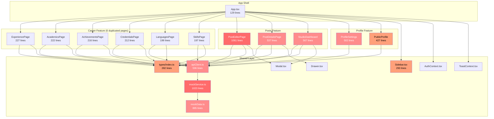
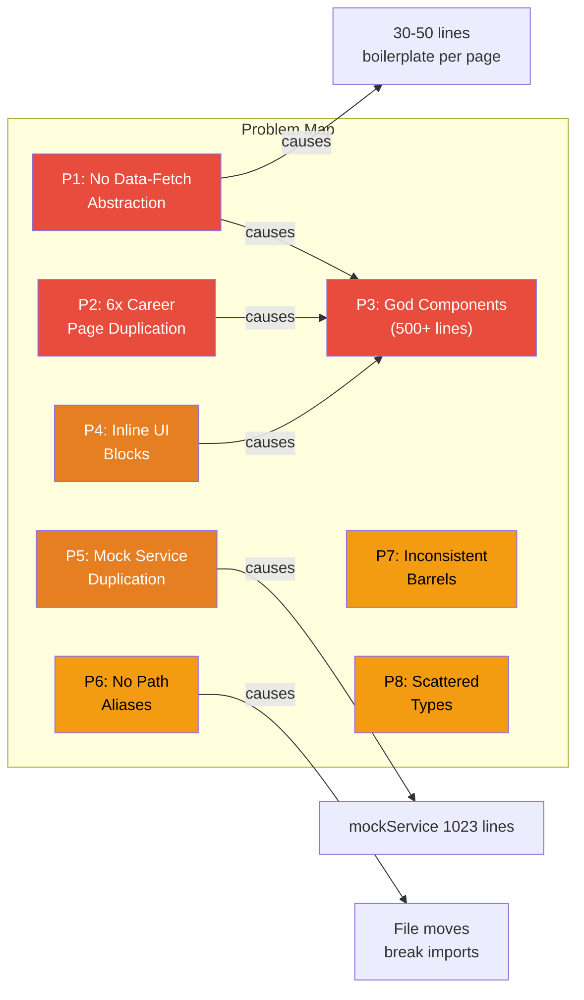
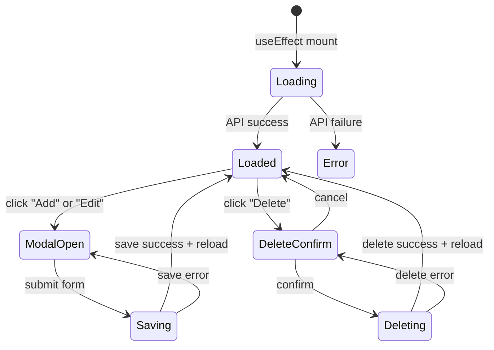
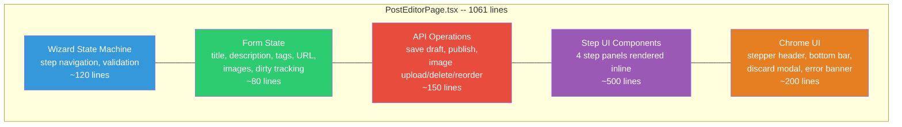
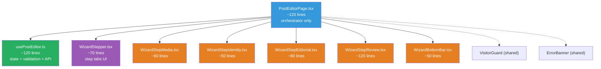
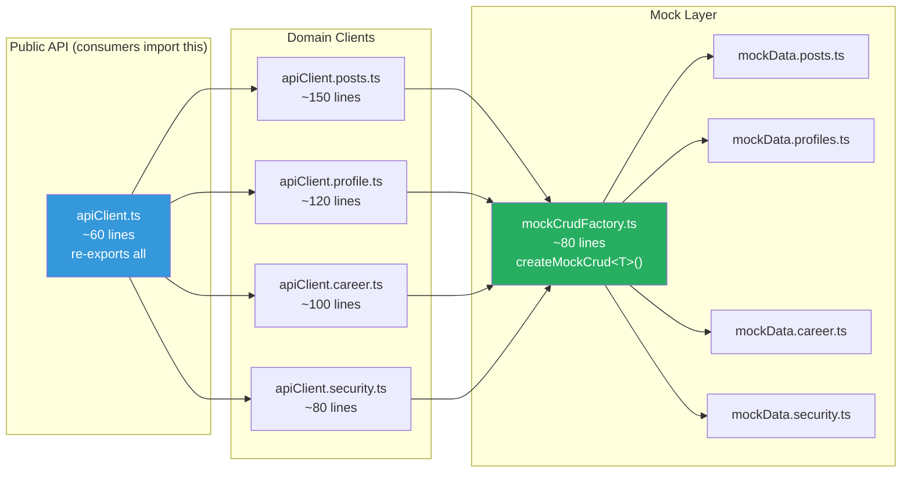
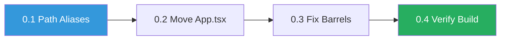
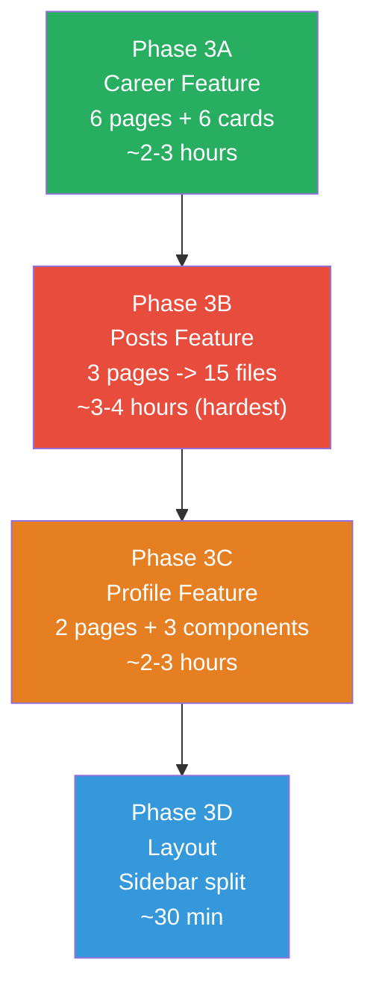

# Showcase.ClientApp -- Refactoring Plan

> **Date:** 2026-09-25
> **Scope:** Frontend structural refactor only -- zero behavior/UI changes
> **Estimated Effort:** 14-20 hours across 5 phases

---

## 1. Current Architecture Map

### 1.1 Directory Tree (Before)

```
src/                                         # 71 files, ~12,300 lines
  App.tsx ........................... 129 lines
  main.tsx .......................... 9 lines
  index.css ......................... 98 lines

  shared/
    api/
      apiClient.ts .................. 596 lines   << MONOLITH
      mockService.ts ................ 1023 lines  << MONOLITH
      mockData.ts ................... 885 lines   << MONOLITH
      careerMockService.ts .......... 183 lines
      careerMockData.ts ............. 82 lines
      index.ts ...................... 3 lines

    components/
      Badge.tsx ..................... 68 lines    (ok)
      Button.tsx .................... 65 lines    (ok)
      Drawer.tsx .................... 149 lines   (duplicate logic with Modal)
      Input.tsx ..................... 83 lines    (ok)
      Modal.tsx ..................... 137 lines   (duplicate logic with Drawer)
      Skeleton.tsx .................. 35 lines    (ok)
      Textarea.tsx .................. 124 lines   (ok)
      index.ts ...................... 7 lines

    context/
      AuthContext.tsx ............... 149 lines
      authContextDef.ts ............. 20 lines
      ToastContext.tsx .............. 76 lines
      toastContextDef.ts ............ 12 lines
      useAuth.ts .................... 9 lines
      useToast.ts ................... 9 lines
      index.ts ...................... 6 lines

    layout/
      Sidebar.tsx ................... 293 lines   << NEEDS SPLIT
      Footer.tsx .................... 107 lines   (ok)
      MobileTopBar.tsx .............. 50 lines    (ok)
      MobileBottomNav.tsx ........... 82 lines    (ok)
      DemoSwitcher.tsx .............. 91 lines    (ok)
      index.ts ...................... 5 lines

    types/
      index.ts ...................... 282 lines   << NEEDS SPLIT
      career.ts ..................... 76 lines    (ok)

  features/
    career/
      components/
        AchievementModal.tsx ........ 286 lines   << NEEDS SPLIT
        CredentialModal.tsx ......... 293 lines   << NEEDS SPLIT
        ExperienceModal.tsx ......... 299 lines   << NEEDS SPLIT
        AcademicModal.tsx ........... 302 lines   << NEEDS SPLIT
        LanguageModal.tsx ........... 181 lines
        SkillModal.tsx .............. 166 lines
        CareerHeader.tsx ............ 67 lines    (ok)
        CareerNavCard.tsx ........... 56 lines    (ok)
        CareerEmptyState.tsx ........ 45 lines    (ok)
        DeleteConfirmModal.tsx ...... 81 lines    (ok)
        index.ts .................... 10 lines
      pages/
        CareerHubPage.tsx ........... 115 lines   (ok)
        CareerExperiencePage.tsx ..... 227 lines  << DUPLICATED PATTERN
        CareerAcademicsPage.tsx ...... 222 lines  << DUPLICATED PATTERN
        CareerAchievementsPage.tsx ... 216 lines  << DUPLICATED PATTERN
        CareerCredentialsPage.tsx .... 212 lines  << DUPLICATED PATTERN
        CareerLanguagesPage.tsx ...... 199 lines  << DUPLICATED PATTERN
        CareerSkillsPage.tsx ......... 197 lines  << DUPLICATED PATTERN
        index.ts .................... 7 lines
      index.ts ...................... 0 lines     << EMPTY!

    posts/
      components/
        PostStatusBadge.tsx ......... 87 lines    (ok)
        ImageDropzone.tsx ........... 333 lines   << NEEDS SPLIT
        ImageReorderGrid.tsx ........ 286 lines   << NEEDS SPLIT
        index.ts .................... 11 lines
      pages/
        PostEditorPage.tsx .......... 1061 lines  << BIGGEST FILE
        StudioDashboardPage.tsx ..... 567 lines   << GOD COMPONENT
        PostDetailsPage.tsx ......... 537 lines   << GOD COMPONENT
        index.ts .................... 3 lines
      index.ts ...................... 2 lines

    profile/
      components/
        BioEditor.tsx ............... 237 lines
        PlatformIcon.tsx ............ 99 lines    (ok)
        SocialLinksManager.tsx ...... 372 lines   << NEEDS SPLIT
        AvatarUploader.tsx .......... 341 lines   << NEEDS SPLIT
        AccountSecurityCard.tsx ..... (small)
        index.ts .................... 5 lines
      pages/
        ProfileSettingsPage.tsx ..... 502 lines   << GOD COMPONENT
        PublicProfilePage.tsx ....... 427 lines   << GOD COMPONENT
        index.ts .................... 2 lines
      index.ts ...................... 2 lines

    security/
      components/
        SecurityNavRow.tsx .......... 65 lines    (ok)
        SecurityActionLayout.tsx .... 54 lines    (ok)
        ProblemAlert.tsx ............ 39 lines    (ok)
      pages/
        SecurityHubPage.tsx ......... 160 lines   (ok)
        TwoFactorAuthPage.tsx ....... 187 lines   (ok)
        UpdateEmailPage.tsx ......... 160 lines   (ok)
        ActiveSessionsPage.tsx ...... 151 lines   (ok)
        ChangePasswordPage.tsx ...... 145 lines   (ok)
        DeleteAccountPage.tsx ....... 109 lines   (ok)
      index.ts ...................... 9 lines

    explore/
      components/
        PostCard.tsx ................ 90 lines    (ok)
      pages/
        ExplorePage.tsx ............. 184 lines   (ok)
      types.ts ...................... 8 lines
      index.ts ...................... 2 lines
```

### 1.2 Dependency Flow (Before)



**Legend:** Red = critical (>500 lines), Orange = needs work (>250 lines)

---

## 2. Problems Diagnosed

### 2.1 The 8 Structural Problems



### 2.2 Problem Detail: Career Page Duplication

All 6 career pages share this identical state machine. Each page copies ~100 lines of this logic:



**Every single career page** independently implements:
- `useState` for: `items`, `loading`, `modalOpen`, `editingItem`, `isSaving`, `deleteTarget`, `isDeleting`
- `loadItems()` with try/catch/finally
- `handleSave()` with create-or-update branch
- `handleDeleteConfirm()` with try/catch/finally
- Loading placeholder JSX
- Empty state JSX
- Item list rendering with Edit/Delete buttons

### 2.3 Problem Detail: PostEditorPage (1061 lines)

This single file contains 5 distinct responsibilities:



### 2.4 Problem Detail: Duplicate Modal/Drawer Logic

Both `Modal.tsx` and `Drawer.tsx` independently implement:

| Logic | Modal.tsx | Drawer.tsx |
|---|---|---|
| Escape key listener | Lines 35-48 | Lines 40-53 |
| Body scroll lock | Lines 50-60 | Lines 55-65 |
| Backdrop click handler | Lines 70-75 | Lines 75-80 |
| Portal rendering | Lines 80+ | Lines 85+ |

These 3 behaviors (`useEscapeKey`, `useScrollLock`, backdrop click) should be shared hooks.

---

## 3. Target Architecture (After)

### 3.1 Directory Tree (After)

```
src/
  app/                                       # NEW folder
    App.tsx ..................... ~80 lines    # Routes only, no inline 404
    AppLayout.tsx .............. ~50 lines    # Shell: sidebar + main + footer
    ScrollToTop.tsx ............ ~15 lines    # Extracted from App.tsx

  shared/
    hooks/                                    # NEW folder -- highest leverage
      useAsyncData.ts .......... ~40 lines   # Generic { data, loading, error, reload }
      useCrudList.ts ........... ~60 lines   # Generic CRUD state machine
      useEscapeKey.ts .......... ~15 lines   # Shared Escape handler
      useScrollLock.ts ......... ~15 lines   # Body scroll lock
      useClickOutside.ts ....... ~20 lines   # Click-outside detection
      index.ts

    api/
      apiClient.ts ............. ~60 lines   # Thin facade, re-exports domain clients
      apiClient.posts.ts ....... ~150 lines  # Post API methods
      apiClient.profile.ts ..... ~120 lines  # Profile API methods
      apiClient.career.ts ...... ~100 lines  # Career API methods
      apiClient.security.ts .... ~80 lines   # Security API methods
      mockCrudFactory.ts ....... ~80 lines   # Generic mock CRUD factory
      mockData.posts.ts ........ ~250 lines  # Post seed data
      mockData.profiles.ts ..... ~200 lines  # Profile seed data
      mockData.career.ts ....... ~150 lines  # Career seed data (merged)
      mockData.security.ts ..... ~100 lines  # Security seed data
      index.ts

    components/
      (existing files kept as-is)
      EmptyState.tsx ........... ~40 lines   # NEW: generic empty state
      ErrorBanner.tsx .......... ~30 lines   # NEW: error alert with retry
      NotFoundView.tsx ......... ~40 lines   # NEW: 404 page
      VisitorGuard.tsx ......... ~35 lines   # NEW: persona guard
      Lightbox.tsx ............. ~50 lines   # NEW: fullscreen image viewer
      index.ts

    layout/
      Sidebar.tsx .............. ~80 lines   # Shell only
      SidebarNavLinks.tsx ...... ~60 lines   # NEW: nav items
      SidebarUserMenu.tsx ...... ~100 lines  # NEW: user dropdown
      (rest unchanged)
      index.ts

    types/
      index.ts ................. ~20 lines   # Re-exports only
      post.ts .................. ~80 lines   # Post types
      profile.ts ............... ~50 lines   # Profile types
      career.ts ................ 76 lines    # Unchanged
      security.ts .............. ~40 lines   # Security types
      common.ts ................ ~30 lines   # Shared utility types
      index.ts

  features/
    career/
      hooks/
        useCareerCrud.ts ....... ~60 lines   # NEW: replaces 6x duplication
      components/
        (existing modals kept, trimmed)
        ExperienceCard.tsx ..... ~50 lines   # NEW: extracted card
        AcademicCard.tsx ....... ~50 lines   # NEW
        AchievementCard.tsx .... ~45 lines   # NEW
        CredentialCard.tsx ..... ~45 lines   # NEW
        LanguageCard.tsx ....... ~40 lines   # NEW
        SkillCard.tsx .......... ~35 lines   # NEW
        index.ts
      pages/
        CareerExperiencePage ... ~80 lines   # Was 227 (-65%)
        CareerAcademicsPage .... ~80 lines   # Was 222 (-64%)
        (same for all 6)
        index.ts
      index.ts ................. (fixed, exports pages + components)

    posts/
      hooks/
        usePostEditor.ts ....... ~120 lines  # NEW: wizard + form state
        usePostActions.ts ...... ~80 lines   # NEW: publish/unpublish/delete
      components/
        (existing kept)
        StudioPostCard.tsx ..... ~90 lines   # NEW: from inline StudioDashboard JSX
        WizardStepper.tsx ...... ~70 lines   # NEW: stepper tabs
        WizardStepMedia.tsx .... ~60 lines   # NEW: Step 1
        WizardStepIdentity.tsx . ~50 lines   # NEW: Step 2
        WizardStepEditorial.tsx  ~80 lines   # NEW: Step 3
        WizardStepReview.tsx ... ~120 lines  # NEW: Step 4
        WizardBottomBar.tsx .... ~50 lines   # NEW: sticky nav
        PostDetailMobile.tsx ... ~130 lines  # NEW: mobile layout
        PostDetailDesktop.tsx .. ~120 lines  # NEW: desktop layout
        index.ts
      pages/
        PostEditorPage.tsx ..... ~120 lines  # Was 1061 (-89%)
        PostDetailsPage.tsx .... ~100 lines  # Was 537 (-81%)
        StudioDashboardPage.tsx  ~150 lines  # Was 567 (-74%)
        index.ts
      index.ts

    profile/
      hooks/
        useProfileSettings.ts .. ~80 lines   # NEW
      components/
        (existing kept, trimmed)
        SocialLinkRow.tsx ...... ~60 lines   # NEW: from SocialLinksManager
        ProfileHeader.tsx ...... ~80 lines   # NEW: from PublicProfilePage
        PostMasonryGrid.tsx .... ~70 lines   # NEW: from PublicProfilePage
        index.ts
      pages/
        ProfileSettingsPage .... ~150 lines  # Was 502 (-70%)
        PublicProfilePage ...... ~200 lines  # Was 427 (-53%)
        index.ts
      index.ts

    security/   (minimal changes -- already well-structured)
    explore/    (no changes -- already clean)
```

### 3.2 Dependency Flow (After)

```mermaid
graph TD
    subgraph "App Shell"
        APP["App.tsx ~80 lines"]
        LAYOUT["AppLayout.tsx ~50 lines"]
    end

    subgraph "Shared Hooks Layer"
        H_ASYNC["useAsyncData"]
        H_CRUD["useCrudList"]
        H_ESC["useEscapeKey"]
        H_SCROLL["useScrollLock"]
        H_CLICK["useClickOutside"]
    end

    subgraph "Shared UI Layer"
        MODAL["Modal.tsx (trimmed)"]
        DRAWER["Drawer.tsx (trimmed)"]
        EMPTY["EmptyState"]
        ERROR["ErrorBanner"]
        NOTFOUND["NotFoundView"]
        GUARD["VisitorGuard"]
        LIGHT["Lightbox"]
    end

    subgraph "API Layer (split)"
        API_F["apiClient facade"]
        API_P["apiClient.posts"]
        API_PR["apiClient.profile"]
        API_C["apiClient.career"]
        API_S["apiClient.security"]
        MOCK_F["mockCrudFactory"]
    end

    subgraph "Career Feature"
        C_HOOK["useCareerCrud"]
        C_CARDS["6x Card components"]
        C_PAGES["6x Pages ~80 lines each"]
    end

    subgraph "Posts Feature"
        P_HOOK_E["usePostEditor"]
        P_HOOK_A["usePostActions"]
        P_WIZARD["WizardStepper + 4 Steps"]
        P_PAGES["3x Pages ~120 lines each"]
    end

    subgraph "Profile Feature"
        PR_HOOK["useProfileSettings"]
        PR_COMPS["ProfileHeader + PostGrid"]
        PR_PAGES["2x Pages ~175 lines each"]
    end

    APP --> LAYOUT
    LAYOUT --> GUARD

    MODAL --> H_ESC & H_SCROLL
    DRAWER --> H_ESC & H_SCROLL

    C_PAGES --> C_HOOK --> H_CRUD --> H_ASYNC
    C_PAGES --> C_CARDS
    C_PAGES --> EMPTY

    P_PAGES --> P_HOOK_E & P_HOOK_A
    P_PAGES --> P_WIZARD & LIGHT
    P_PAGES --> GUARD & EMPTY & ERROR

    PR_PAGES --> PR_HOOK
    PR_PAGES --> PR_COMPS

    C_HOOK --> API_C --> MOCK_F
    P_HOOK_E --> API_P --> MOCK_F
    PR_HOOK --> API_PR --> MOCK_F

    style H_ASYNC fill:#27ae60,color:#fff
    style H_CRUD fill:#27ae60,color:#fff
    style H_ESC fill:#27ae60,color:#fff
    style H_SCROLL fill:#27ae60,color:#fff
    style MOCK_F fill:#27ae60,color:#fff
    style API_F fill:#3498db,color:#fff
```



---

## 4. Before/After Comparison

### 4.1 Line Count Impact

| Area | Before (lines) | After (lines) | Reduction |
|---|---|---|---|
| `PostEditorPage.tsx` | 1061 | ~120 (+ 6 extracted files ~430 total) | Page: -89% |
| `StudioDashboardPage.tsx` | 567 | ~150 (+ PostCard ~90) | Page: -74% |
| `PostDetailsPage.tsx` | 537 | ~100 (+ Mobile/Desktop ~250) | Page: -81% |
| `ProfileSettingsPage.tsx` | 502 | ~150 (+ hook ~80) | Page: -70% |
| `PublicProfilePage.tsx` | 427 | ~200 (+ Header/Grid ~150) | Page: -53% |
| `mockService.ts` | 1023 | ~80 factory + ~700 split data | File: -92% |
| `mockData.ts` | 885 | 4 files ~700 total | File eliminated |
| `apiClient.ts` | 596 | ~60 facade + 4 domain files ~450 | File: -90% |
| `Sidebar.tsx` | 293 | ~80 (+ NavLinks ~60, UserMenu ~100) | File: -73% |
| `types/index.ts` | 282 | ~20 barrel + 5 domain files ~280 | File: -93% |
| 6 Career pages | 1273 total | ~480 total (+ hook + 6 cards) | -62% |
| **Total project** | **~12,300** | **~12,800** (more files, same code) | Files max <250 |

> Total line count slightly increases because extraction adds import lines and file headers.
> The goal is not fewer total lines -- it is **no file exceeds 250 lines**.

### 4.2 File Count Impact

| Metric | Before | After |
|---|---|---|
| Total files | 71 | ~105 |
| Files > 500 lines | 5 | 0 |
| Files > 300 lines | 10 | 0 |
| Files > 250 lines | 14 | 0 |
| Max file size | 1061 | ~200 |
| Avg file size | 173 | ~122 |

### 4.3 Visual: Career Page Before vs After

**BEFORE** -- CareerExperiencePage.tsx (227 lines):

```
+-----------------------------------------------+
| CareerExperiencePage (227 lines)               |
|                                                |
|  [7 useState declarations]                     |
|  [useCallback: loadItems]                      |
|  [useEffect: fetch on mount]                   |
|  [handleOpenCreate]                            |
|  [handleOpenEdit]                              |
|  [handleSave - create/update branch]           |
|  [handleDeleteConfirm]                         |
|  [formatDateRange]                             |
|                                                |
|  return (                                      |
|    <CareerHeader />                            |
|    {loading ? <inline skeleton> :              |
|     items.length === 0 ? <CareerEmptyState> :  |
|     <div>                                      |
|       {items.map(exp => (                      |
|         <div> <<<< 90 lines of inline JSX      |
|           company, title, date, location,      |
|           description, achievements, skills,   |
|           edit button, delete button           |
|         </div>                                 |
|       ))}                                      |
|     </div>                                     |
|    }                                           |
|    <ExperienceModal />                         |
|    <DeleteConfirmModal />                      |
|  )                                             |
+-----------------------------------------------+
```

**AFTER** -- CareerExperiencePage.tsx (~80 lines):

```
+-----------------------------------------------+
| CareerExperiencePage (~80 lines)               |
|                                                |
|  const crud = useCareerCrud({                  |
|    loadFn: apiClient.getExperiences,           |
|    createFn: apiClient.createExperience,       |
|    updateFn: apiClient.updateExperience,       |
|    deleteFn: apiClient.deleteExperience,       |
|    entityLabel: "Position",                    |
|  });                                           |
|                                                |
|  return (                                      |
|    <CareerHeader onAction={crud.openCreate} /> |
|    <CrudListView                               |
|      crud={crud}                               |
|      emptyIcon={Briefcase}                     |
|      renderItem={(exp) => (                    |
|        <ExperienceCard                         |
|          item={exp}                            |
|          onEdit={crud.openEdit}                |
|          onDelete={crud.setDeleteTarget}       |
|        />                                      |
|      )}                                        |
|    />                                          |
|    <ExperienceModal ... />                     |
|    <DeleteConfirmModal ... />                  |
|  )                                             |
+-----------------------------------------------+

+-----------------------------------------------+
| useCareerCrud.ts (~60 lines)                   |
|  Manages: items, loading, modalOpen,           |
|  editingItem, isSaving, deleteTarget,          |
|  isDeleting, loadItems, handleSave,            |
|  handleDelete                                  |
+-----------------------------------------------+

+-----------------------------------------------+
| ExperienceCard.tsx (~50 lines)                 |
|  Pure presentational: company badge,           |
|  job title, date range, location,              |
|  description, skills chips,                    |
|  edit/delete action buttons                    |
+-----------------------------------------------+
```

### 4.4 Visual: PostEditorPage Before vs After

**BEFORE** -- One file, 1061 lines:

```
PostEditorPage.tsx (1061 lines)
 |
 |-- Constants (SUGGESTED_TAGS, WIZARD_STEPS)      ~55 lines
 |-- State declarations (15 useState)              ~30 lines
 |-- useEffect: beforeunload                       ~10 lines
 |-- useEffect: load existing post                 ~50 lines
 |-- Tag handlers                                  ~25 lines
 |-- Cancel/discard handler                        ~10 lines
 |-- Image handlers (upload, reorder, delete)      ~65 lines
 |-- URL normalization                             ~10 lines
 |-- Step validation                               ~50 lines
 |-- Full form validation                          ~20 lines
 |-- Step navigation                               ~25 lines
 |-- Save draft handler                            ~55 lines
 |-- Publish handler                               ~65 lines
 |-- Visitor guard JSX                             ~30 lines
 |-- Loading skeleton JSX                          ~10 lines
 |-- Stepper header JSX                            ~70 lines
 |-- Step framing JSX                              ~15 lines
 |-- Error banner JSX                              ~15 lines
 |-- Step 1: Media JSX                             ~50 lines
 |-- Step 2: Identity JSX                          ~35 lines
 |-- Step 3: Editorial JSX                         ~100 lines
 |-- Step 4: Review JSX                            ~130 lines
 |-- Bottom navigation bar JSX                     ~60 lines
 |-- Discard modal JSX                             ~25 lines
```

**AFTER** -- 8 files, ~550 total lines:



### 4.5 Visual: API Layer Before vs After

**BEFORE:**

```
apiClient.ts (596 lines)
  |-- getMyPosts()
  |-- getPostById()
  |-- createPost()
  |-- updatePost()
  |-- publishPost()
  |-- unpublishPost()
  |-- deletePost()
  |-- addPostImage()
  |-- removePostImage()
  |-- reorderPostImages()
  |-- getPublicProfile()
  |-- updateProfile()
  |-- uploadAvatar()
  |-- getSocialLinks()
  |-- addSocialLink()
  |-- updateSocialLink()
  |-- deleteSocialLink()
  |-- getExperiences()
  |-- createExperience()
  |-- ... (30+ more methods)

mockService.ts (1023 lines)
  |-- getMockPosts()        -- identical pattern
  |-- getMockPostById()     -- identical pattern
  |-- createMockPost()      -- identical pattern
  |-- updateMockPost()      -- identical pattern
  |-- deleteMockPost()      -- identical pattern
  |-- getMockProfiles()     -- identical pattern (copy-pasted)
  |-- ... (all repeated per entity)
```

**AFTER:**



---

## 5. Execution Phases -- Step by Step

### Phase 0: Infrastructure



#### Step 0.1: Add Path Aliases

**Files:** `tsconfig.app.json`, `vite.config.ts`

**What:** Add `@shared/*`, `@features/*`, `@app/*` path aliases.

**Why:** All current imports use deep relative paths like `../../../shared/components/Button.tsx`. Path aliases make file moves safe and imports readable.

**tsconfig.app.json change:**
```json
{
  "compilerOptions": {
    "paths": {
      "@shared/*": ["./src/shared/*"],
      "@features/*": ["./src/features/*"],
      "@app/*": ["./src/app/*"]
    }
  }
}
```

**vite.config.ts change:**
```ts
resolve: {
  alias: {
    '@shared': path.resolve(__dirname, 'src/shared'),
    '@features': path.resolve(__dirname, 'src/features'),
    '@app': path.resolve(__dirname, 'src/app'),
  }
}
```

> Note: Existing relative imports keep working. We migrate them gradually in later steps.

#### Step 0.2: Create `src/app/` and Extract App Components

**From:** `src/App.tsx` (129 lines)
**To:**
- `src/app/App.tsx` -- route definitions only (~80 lines)
- `src/app/AppLayout.tsx` -- shell: sidebar + main + footer (~50 lines)
- `src/app/ScrollToTop.tsx` -- scroll behavior (~15 lines)

**Why:** App.tsx currently mixes routing, layout shell, scroll behavior, and an inline 404 page.

#### Step 0.3: Fix Barrel Exports

**Files:** All `index.ts` files

- `features/career/index.ts` -- currently **empty**. Export pages and components.
- Ensure every feature has consistent exports:
  - `feature/index.ts` re-exports from `pages/index.ts`
  - `feature/pages/index.ts` exports all page components
  - `feature/components/index.ts` exports all components

#### Step 0.4: Build Verification

```bash
npm run build
npm run dev   # smoke test all routes
```

**Commit message:** `refactor: add path aliases, extract app shell, fix barrel exports`

---

### Phase 1: Extract Shared Hooks


#### Step 1.1: `useEscapeKey` Hook

**Extract from:** `Modal.tsx` (lines 35-48), `Drawer.tsx` (similar), `PostDetailsPage.tsx` (lines 28-37)

**New file:** `src/shared/hooks/useEscapeKey.ts` (~15 lines)

```ts
// Calls handler when Escape key is pressed while the hook is active
function useEscapeKey(handler: () => void, enabled: boolean = true): void
```

**Then:** Replace the 3 duplicate `useEffect` blocks in Modal, Drawer, and PostDetailsPage with `useEscapeKey(onClose, isOpen)`.

#### Step 1.2: `useScrollLock` Hook

**Extract from:** `Modal.tsx`, `Drawer.tsx`

**New file:** `src/shared/hooks/useScrollLock.ts` (~15 lines)

```ts
// Locks body scroll when enabled, restores on cleanup
function useScrollLock(enabled: boolean): void
```

#### Step 1.3: `useClickOutside` Hook

**Extract from:** `Sidebar.tsx` (lines 36-49)

**New file:** `src/shared/hooks/useClickOutside.ts` (~20 lines)

```ts
// Calls handler when click occurs outside the ref element
function useClickOutside(ref: RefObject<HTMLElement>, handler: () => void): void
```

#### Step 1.4: `useAsyncData` Hook

**Extract from:** Pattern repeated in every page that fetches data

**New file:** `src/shared/hooks/useAsyncData.ts` (~40 lines)

```ts
interface UseAsyncDataResult<T> {
  data: T | null;
  isLoading: boolean;
  error: string | null;
  reload: () => Promise<void>;
}

function useAsyncData<T>(
  fetchFn: () => Promise<T>,
  deps?: unknown[]
): UseAsyncDataResult<T>
```

**Why:** Every page currently has this boilerplate:
```ts
const [data, setData] = useState(null);
const [isLoading, setIsLoading] = useState(true);
const [error, setError] = useState(null);

const load = useCallback(async () => {
  setIsLoading(true);
  try {
    const result = await apiFn();
    setData(result);
  } catch (err) {
    setError("Failed to load");
  } finally {
    setIsLoading(false);
  }
}, []);

useEffect(() => {
  let cancelled = false;
  void Promise.resolve().then(async () => {
    if (cancelled) return;
    await load();
  });
  return () => { cancelled = true; };
}, [load]);
```

This 25-line block appears in 10+ pages. `useAsyncData` replaces it with one line.

#### Step 1.5: `useCareerCrud` Hook

**Extract from:** 6 career pages (identical state machine)

**New file:** `src/features/career/hooks/useCareerCrud.ts` (~60 lines)

```ts
interface UseCareerCrudConfig<T> {
  loadFn: () => Promise<T[]>;
  createFn: (data: Omit<T, 'id' | 'createdAt'>) => Promise<T>;
  updateFn: (id: string, data: Partial<T>) => Promise<T>;
  deleteFn: (id: string) => Promise<void>;
  entityLabel: string;  // for toast messages: "Position", "Degree", etc.
}

interface UseCareerCrudResult<T> {
  items: T[];
  loading: boolean;
  modalOpen: boolean;
  editingItem: T | null;
  isSaving: boolean;
  deleteTarget: T | null;
  isDeleting: boolean;
  openCreate: () => void;
  openEdit: (item: T) => void;
  setDeleteTarget: (item: T | null) => void;
  handleSave: (data: Omit<T, 'id' | 'createdAt'>) => Promise<void>;
  handleDeleteConfirm: () => Promise<void>;
  closeModal: () => void;
}
```

**Impact:** Each career page goes from ~220 lines to ~80 lines.

#### Step 1.6: Build Verification

```bash
npm run build
# Manually verify: Modal close on Escape, Drawer close, career page CRUD flow
```

**Commit message:** `refactor: extract shared hooks (useAsyncData, useCrudList, useEscapeKey, useScrollLock, useClickOutside)`

---

### Phase 2: Extract Shared UI Components


#### Step 2.1: `EmptyState` Component

**Extract from:** StudioDashboardPage (lines 376-401), CareerEmptyState pattern, PostDetailsPage 404 view

**New file:** `src/shared/components/EmptyState.tsx` (~40 lines)

```ts
interface EmptyStateProps {
  icon: LucideIcon;
  title: string;
  description: string;
  actionLabel?: string;
  onAction?: () => void;
}
```

**Why:** At least 5 pages render a centered icon + title + description + optional CTA for empty/404 states. The existing `CareerEmptyState` is feature-specific but follows the same pattern.

#### Step 2.2: `ErrorBanner` Component

**Extract from:** StudioDashboardPage (lines 340-350), PostEditorPage (lines 642-655)

**New file:** `src/shared/components/ErrorBanner.tsx` (~30 lines)

```ts
interface ErrorBannerProps {
  message: string;
  onRetry?: () => void;
}
```

#### Step 2.3: `NotFoundView` Component

**Extract from:** App.tsx (inline 404, lines 93-119), PostDetailsPage (lines 141-166)

**New file:** `src/shared/components/NotFoundView.tsx` (~40 lines)

#### Step 2.4: `VisitorGuard` Component

**Extract from:** StudioDashboardPage (lines 210-240), PostEditorPage (lines 504-533)

**New file:** `src/shared/components/VisitorGuard.tsx` (~35 lines)

Both pages render an identical "Creator Mode Required" block when `activePersona === "visitor"`. Extract to a shared guard.

#### Step 2.5: `Lightbox` Component

**Extract from:** PostDetailsPage (lines 509-533)

**New file:** `src/shared/components/Lightbox.tsx` (~50 lines)

Uses `useEscapeKey` from Phase 1.

#### Steps 2.6-2.7: Trim Modal and Drawer

Replace duplicated `useEffect` blocks with `useEscapeKey` and `useScrollLock` hooks. No behavior change, just shorter code.

**Commit message:** `refactor: extract shared UI components (EmptyState, ErrorBanner, NotFoundView, VisitorGuard, Lightbox)`

---

### Phase 3: Split God Components

This is the largest phase, broken into 4 sub-phases by feature.



#### Phase 3A: Career Feature

**For each of the 6 career pages:**

1. Extract the inline item card JSX into `{Entity}Card.tsx`
2. Replace the 7 `useState` + handlers with `useCareerCrud` hook
3. Use `EmptyState` from shared components

**Example transformation for `CareerExperiencePage`:**

| Before | After |
|---|---|
| 7 `useState` calls | `useCareerCrud(config)` -- 1 call |
| `loadItems` callback | Handled by hook |
| `useEffect` fetch | Handled by hook |
| `handleOpenCreate` | `crud.openCreate` |
| `handleOpenEdit` | `crud.openEdit` |
| `handleSave` | `crud.handleSave` |
| `handleDeleteConfirm` | `crud.handleDeleteConfirm` |
| 90 lines inline card JSX | `<ExperienceCard>` component |

**Repeat for:** Academics, Achievements, Credentials, Languages, Skills

#### Phase 3B: Posts Feature (Hardest Phase)

**Step 3B.1: PostEditorPage (1061 -> ~120 lines)**

Split into:

| New File | Content | Lines |
|---|---|---|
| `usePostEditor.ts` | State, validation, save/publish handlers | ~120 |
| `WizardStepper.tsx` | Step tabs UI | ~70 |
| `WizardStepMedia.tsx` | Step 1: image upload/reorder | ~60 |
| `WizardStepIdentity.tsx` | Step 2: title + URL inputs | ~50 |
| `WizardStepEditorial.tsx` | Step 3: description + tags | ~80 |
| `WizardStepReview.tsx` | Step 4: preview + guidance cards | ~120 |
| `WizardBottomBar.tsx` | Sticky bottom navigation | ~50 |
| `PostEditorPage.tsx` | Orchestrator: passes hook data to step components | ~120 |

**Step 3B.2: PostDetailsPage (537 -> ~100 lines)**

Split into:

| New File | Content | Lines |
|---|---|---|
| `PostDetailMobile.tsx` | Mobile carousel + info flow (lines 227-363) | ~130 |
| `PostDetailDesktop.tsx` | Desktop two-column hero + gallery (lines 366-506) | ~120 |
| Uses `Lightbox` | Fullscreen image viewer (already extracted in Phase 2) | -- |
| `PostDetailsPage.tsx` | Data fetch + loading/error/404 guards + delegates to Mobile/Desktop | ~100 |

**Step 3B.3: StudioDashboardPage (567 -> ~150 lines)**

Split into:

| New File | Content | Lines |
|---|---|---|
| `usePostActions.ts` | Publish/unpublish/delete logic | ~80 |
| `StudioPostCard.tsx` | Single post card (lines 411-530) | ~90 |
| `StudioDashboardPage.tsx` | Toolbar + filter/sort + maps over PostCard | ~150 |

#### Phase 3C: Profile Feature

**Step 3C.1: ProfileSettingsPage (502 -> ~150 lines)**

Extract tab content into dedicated sub-components or use existing components (BioEditor, SocialLinksManager, AvatarUploader are already separate). The page should just be a tab orchestrator.

**Step 3C.2: PublicProfilePage (427 -> ~200 lines)**

Extract:
- `ProfileHeader.tsx` (~80 lines) -- avatar, name, bio, stats
- `PostMasonryGrid.tsx` (~70 lines) -- masonry post grid with pagination

**Step 3C.3: SocialLinksManager (372 -> ~200 lines)**

Extract `SocialLinkRow.tsx` (~60 lines) for individual link editing.

#### Phase 3D: Layout

**Sidebar.tsx (293 -> ~80 lines)**

Extract:
- `SidebarNavLinks.tsx` (~60 lines) -- navigation link list
- `SidebarUserMenu.tsx` (~100 lines) -- user account dropdown with popover

---

### Phase 4: Split API & Data Layer


#### Step 4.1: Split `apiClient.ts` (596 lines)

Split by domain:

| New File | Methods | Lines |
|---|---|---|
| `apiClient.posts.ts` | getMyPosts, getPostById, createPost, updatePost, publishPost, unpublishPost, deletePost, addPostImage, removePostImage, reorderPostImages | ~150 |
| `apiClient.profile.ts` | getPublicProfile, updateProfile, uploadAvatar, getSocialLinks, addSocialLink, updateSocialLink, deleteSocialLink | ~120 |
| `apiClient.career.ts` | getExperiences, createExperience, updateExperience, deleteExperience, ... (6 entities x 4 CRUD) | ~100 |
| `apiClient.security.ts` | changePassword, updateEmail, enable2FA, disable2FA, getSessions, revokeSession, deleteAccount | ~80 |
| `apiClient.ts` | Import and re-export everything as unified `apiClient` object | ~60 |

**Existing consumers do not change** because the facade re-exports the same `apiClient` object.

#### Step 4.2: Generic Mock CRUD Factory

**Replace:** `mockService.ts` (1023 lines of copy-pasted CRUD)

**New file:** `src/shared/api/mockCrudFactory.ts` (~80 lines)

```ts
interface MockCrudConfig<T extends { id: string }> {
  storageKey: string;
  defaultData: T[];
  delay?: number;
}

function createMockCrud<T extends { id: string }>(config: MockCrudConfig<T>) {
  return {
    getAll: async (): Promise<T[]> => { ... },
    getById: async (id: string): Promise<T> => { ... },
    create: async (data: Omit<T, 'id'>): Promise<T> => { ... },
    update: async (id: string, data: Partial<T>): Promise<T> => { ... },
    delete: async (id: string): Promise<void> => { ... },
  };
}
```

Each entity becomes a one-liner:
```ts
export const experienceMock = createMockCrud<CareerExperience>({
  storageKey: 'career_experiences',
  defaultData: defaultExperiences,
});
```

#### Step 4.3: Split `mockData.ts` (885 lines)

Split into:
- `mockData.posts.ts` (~250 lines)
- `mockData.profiles.ts` (~200 lines)
- `mockData.career.ts` (~150 lines, merge with `careerMockData.ts`)
- `mockData.security.ts` (~100 lines)

#### Step 4.4: Split `shared/types/index.ts` (282 lines)

Split into:
- `types/post.ts` -- PostSummaryResponse, PostDetailsResponse, PostStatus, etc.
- `types/profile.ts` -- PublicProfileResponse, SocialLink, etc.
- `types/career.ts` -- already exists (76 lines, keep as-is)
- `types/security.ts` -- Session, SecuritySettings, etc.
- `types/common.ts` -- PaginatedResponse, ApiError, etc.
- `types/index.ts` -- re-exports everything (barrel only, ~20 lines)

**Existing consumers do not change** because `import from 'shared/types'` still works via barrel.

---

### Phase 5: Final Cleanup

| Step | What | Verification |
|---|---|---|
| 5.1 | Migrate remaining relative imports to path aliases | `grep -r '\.\./\.\./\.\.' src/` returns 0 results |
| 5.2 | Ensure all barrel exports are consistent | Every `index.ts` exports its folder's public API |
| 5.3 | Full build + lint + type check | `npm run build` passes with 0 errors |
| 5.4 | Manual smoke test | Navigate every route, test CRUD on career, create/edit post |

---

## 6. Risk Matrix

| Risk | Probability | Impact | Mitigation |
|---|---|---|---|
| Import breakage when moving files | Medium | Low | Path aliases absorb moves. Phase 0 first. |
| Component props change during extraction | Low | Medium | Extract JSX exactly as-is. Props are derived from closure variables. |
| State timing changes (race conditions) | Low | High | Never change useEffect/useState structure in extraction step. Only move code. |
| Circular imports from barrel re-exports | Low | Medium | Features import from direct paths internally, never from own barrel. |
| Regression in form validation | Low | High | Validation logic moves to hooks unchanged. Test each form after extraction. |
| Lost during long refactor | Medium | Medium | Each phase is independently committable. Document progress in this file. |

---

## 7. Out of Scope

These items are explicitly NOT part of this refactor:

| Item | Why Excluded |
|---|---|
| Add React Query / SWR | Library addition, not structural refactor |
| Add Zustand / Redux | Same |
| CSS / Tailwind theming | Separate visual concern |
| Add unit tests | Follow-up task after structure is clean |
| Performance optimization | Separate concern |
| Accessibility improvements | Separate audit |
| New features | Not a refactor |
| API contract changes | Backend concern |

---

## 8. Success Criteria

| Criteria | Measurable Target |
|---|---|
| Max file size | No file > 250 lines |
| Max function size | No function > 50 lines |
| Max JSX nesting | No nesting > 4 levels |
| Duplicated state machines | Zero (career CRUD, fetch pattern) |
| Import style | All use path aliases |
| Barrel consistency | Every folder has complete index.ts |
| Build status | `npm run build` = 0 errors |
| Visual regression | All routes render identically |
| Type organization | Types split by domain |

---

## 9. Progress Tracker

| Phase | Status | Commit | Notes |
|---|---|---|---|
| Phase 0: Infrastructure | COMPLETED | | Path aliases configured, src/app extracted, barrels populated |
| Phase 1: Shared Hooks | COMPLETED | | useEscapeKey, useScrollLock, useClickOutside, useAsyncData, useCareerCrud, useCrudList created and exported |
| Phase 2: Shared UI | COMPLETED | | EmptyState, ErrorBanner, NotFoundView, VisitorGuard, Lightbox created; Modal and Drawer trimmed; EmptyState integrated across Studio, Profile, and Career |
| Phase 3A: Career Split | COMPLETED | | 6 entity cards extracted, all 6 career pages refactored with useCareerCrud, CareerEmptyState composes EmptyState |
| Phase 3B: Posts Split | COMPLETED | | PostEditorPage, PostDetailsPage, and StudioDashboardPage split into cohesive hooks (usePostEditor, usePostEditorSubmit, usePostActions, useDropzoneUpload) and components |
| Phase 3C: Profile Split | COMPLETED | | SocialLinksManager, PublicProfilePage, ProfileSettingsPage (with useProfileSettings), AvatarUploader, AccountSecurityCard split into small cohesive units |
| Phase 3D: Layout Split | COMPLETED | | SidebarNavLinks and SidebarUserMenu extracted from Sidebar.tsx, useClickOutside integrated |
| Phase 4: API/Mock/Types | COMPLETED | | apiClient, mockService, mockData, and shared types split into domain modules; careerMockService unified via mockCrudFactory |
| Phase 5: Final Cleanup | COMPLETED | | All files <= 250 lines, functions <= 50 lines, relative imports eliminated, zero lint/tsc errors, emoji audit clean |


