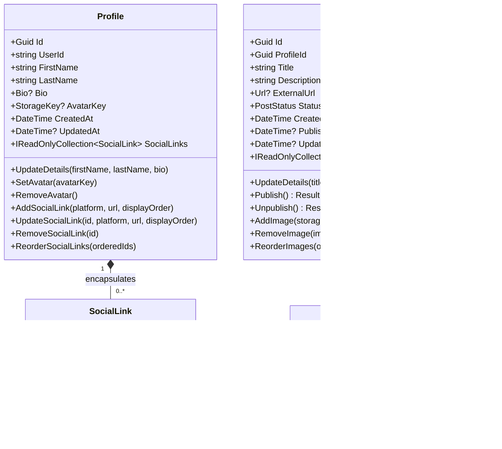

# Showcase Portfolio Platform — Backend Comprehensive Technical Documentation

> **Platform Version:** 1.0.0
> **Runtime / Framework:** .NET 10 (C# 14)
> **Architecture Pattern:** Clean Architecture (4 Layers) + CQRS via MediatR + Pragmatic Domain-Driven Design (DDD)
> **Database:** PostgreSQL via Entity Framework Core 10
> **Object Storage:** Cloudflare R2 (S3-Compatible Object Storage)
> **Authentication:** ASP.NET Core Identity + Stateless JWT Bearer Tokens + Rotatable Refresh Tokens
> **API Style:** Minimal APIs with `IEndpoint` Auto-Discovery & RFC 7807 ProblemDetails
> **Diagnostic & Security:** ASP.NET Core Health Checks + Built-in Rate Limiting

---

## Table of Contents

1. [Architectural Overview & Design Principles](#1-architectural-overview--design-principles)
2. [Domain Layer (`Showcase.Domain`)](#2-domain-layer-showcasedomain)
   - [2.1 Aggregates & Entities](#21-aggregates--entities)
   - [2.2 Value Objects](#22-value-objects)
   - [2.3 Enums](#23-enums)
   - [2.4 Invariants & Business Logic](#24-invariants--business-logic)
   - [2.5 Domain Error Catalog](#25-domain-error-catalog)
3. [Application Layer (`Showcase.Application`)](#3-application-layer-showcaseapplication)
   - [3.1 CQRS Vertical Slices](#31-cqrs-vertical-slices)
   - [3.2 Pipeline Behaviors](#32-pipeline-behaviors)
   - [3.3 Service Interfaces & Contracts](#33-service-interfaces--contracts)
   - [3.4 Features & Command/Query Catalog](#34-features--commandquery-catalog)
4. [Infrastructure Layer (`Showcase.Infrastructure`)](#4-infrastructure-layer-showcaseinfrastructure)
   - [4.1 Identity & ApplicationUser](#41-identity--applicationuser)
   - [4.2 Token Service (JWT & Refresh Token Rotation)](#42-token-service-jwt--refresh-token-rotation)
   - [4.3 Cloudflare R2 Object Storage Integration](#43-cloudflare-r2-object-storage-integration)
   - [4.4 EF Core Persistence & Database Mapping](#44-ef-core-persistence--database-mapping)
   - [4.5 Diagnostics & PostgreSQL Health Check](#45-diagnostics--postgresql-health-check)
5. [API Layer (`Showcase.Api`) & Pipeline Architecture](#5-api-layer-showcaseapi--pipeline-architecture)
   - [5.1 HTTP Middleware Pipeline](#51-http-middleware-pipeline)
   - [5.2 OpenAPI / Swagger UI Configuration](#52-openapi--swagger-ui-configuration)
   - [5.3 Rate Limiting Architecture & Policies](#53-rate-limiting-architecture--policies)
   - [5.4 RFC 7807 ProblemDetails Error Mapping](#54-rfc-7807-problemdetails-error-mapping)
6. [Complete REST API Reference](#6-complete-rest-api-reference)
   - [6.1 Authentication & Account Security Endpoints](#61-authentication--account-security-endpoints)
   - [6.2 Creator Profiles Endpoints](#62-creator-profiles-endpoints)
   - [6.3 Social Links Endpoints](#63-social-links-endpoints)
   - [6.4 Posts & Post Images Endpoints](#64-posts--post-images-endpoints)
   - [6.5 Discovery, Feeds & Health Endpoints](#65-discovery-feeds--health-endpoints)
7. [Configuration Reference (`appsettings.json`)](#7-configuration-reference-appsettingsjson)
8. [Automated Verification & Test Suite](#8-automated-verification--test-suite)

---

## 1. Architectural Overview & Design Principles

The Showcase Portfolio Platform backend is structured in strict adherence to **Clean Architecture**. Dependencies point strictly inward towards the enterprise core (`Showcase.Domain`), ensuring total independence from external persistence, UI, identity frameworks, and third-party cloud SDKs.

```
┌─────────────────────────────────────────────────────────────┐
│                       Showcase.Api                          │
│   (Minimal APIs, IEndpoint Discovery, Swagger, RateLimit)   │
└───────────────┬─────────────────────────────┬───────────────┘
                │                             │
                ▼                             ▼
┌──────────────────────────────┐ ┌────────────────────────────┐
│    Showcase.Application      │ │   Showcase.Infrastructure  │
│  (CQRS, MediatR, Validators, │ │ (EF Core, Identity, R2 S3, │
│    Behaviors, DTOs, Slices)  │ │  HealthChecks, Tokens)     │
└───────────────┬──────────────┘ └────────────┬───────────────┘
                │                             │
                ▼                             ▼
┌─────────────────────────────────────────────────────────────┐
│                      Showcase.Domain                        │
│                (Pure C# - Zero Dependencies)                │
│    Profile, SocialLink, Post, PostImage, Value Objects      │
└─────────────────────────────────────────────────────────────┘
```

### Core Design Rules & Principles:

1. **Pure Domain Model**: `Showcase.Domain` contains 0 NuGet packages and zero third-party dependencies. Entities encapsulate business invariants through rich domain methods rather than anemic getters/setters.
2. **Result Pattern Everywhere**: Business logic never throws control-flow exceptions. Operations return `Result` or `Result<T>` with typed `Error` objects (`Error.NotFound`, `Error.Validation`, `Error.Conflict`, `Error.Unauthorized`, `Error.Forbidden`).
3. **Zero Social Network Bloat**: Explicitly excludes likes, comments, follower graphs, notifications, and complex feed algorithms. The platform is designed purely for showcase and discovery.
4. **Decoupled Image Ingestion**: Web servers never process raw image byte streams. Clients request presigned `PUT` upload URLs from Cloudflare R2 and upload directly, after which they notify the backend to commit the `StorageKey`.
5. **CQRS with MediatR**: Every request is treated as either a mutating `Command` or an idempotent `Query`.

---

## 2. Domain Layer (`Showcase.Domain`)

### 2.1 Aggregates & Entities



### 2.2 Value Objects

- **`Bio`**: Immutable record encapsulating creator biography text. Validates that text cannot exceed 500 characters.
- **`Url`**: Immutable record enforcing absolute URI format (`http://` or `https://`).
- **`StorageKey`**: Immutable record validating non-empty Cloudflare R2 object key strings (e.g. `avatars/{profileId}/{guid}.webp` or `posts/{profileId}/{guid}.jpg`).

### 2.3 Enums

- **`PostStatus`**:
  - `Draft = 0`: Work in progress; strictly hidden from public discovery and search.
  - `Published = 1`: Work made publicly discoverable in the Explore feed and on creator's public profile.
  - `Unpublished = 2`: Previously published work withdrawn from public visibility.

### 2.4 Invariants & Business Logic

1. **Publishing Requires Media**: A post cannot be published unless it contains at least 1 attached `PostImage`. Attempting to publish without images yields `PostErrors.CannotPublishEmptyPost`.
2. **Published Post Image Integrity**: A published post cannot delete its last remaining image while in `Published` status (`PostErrors.CannotRemoveLastImageFromPublishedPost`). It must either be unpublished first or another image must be added.
3. **Strict Ownership Enforcement**: All mutations (Profile, SocialLinks, Posts, Images) verify creator ownership (`currentUserService.UserId`). Mismatches return `PostErrors.UnauthorizedAccess` or `ProfileErrors.NotFoundForUser`.
4. **Draft Privacy**: Draft and Unpublished posts queried by ID return `PostErrors.NotFound` (404) to anonymous visitors or non-owners to prevent data leakage.

### 2.5 Domain Error Catalog

| Error Code                                    | Error Type       | Description / Trigger                                            |
| :-------------------------------------------- | :--------------- | :--------------------------------------------------------------- |
| `Profile.NotFound`                            | NotFound (404)   | Profile not found for requested username or identifier           |
| `Profile.NotFoundForUser`                     | NotFound (404)   | Authenticated user has no associated creator profile             |
| `Profile.InvalidBio`                          | Validation (400) | Bio exceeds max 500 characters                                   |
| `SocialLink.NotFound`                         | NotFound (404)   | Social link ID does not exist under the target profile           |
| `SocialLink.InvalidUrl`                       | Validation (400) | URL provided is not a valid absolute HTTP/HTTPS address          |
| `Post.NotFound`                               | NotFound (404)   | Post ID not found or post is in Draft state queried by non-owner |
| `Post.UnauthorizedAccess`                     | Forbidden (403)  | Current user does not own the post aggregate root                |
| `Post.CannotPublishEmptyPost`                 | Validation (400) | Invariant: Cannot publish a post without at least 1 image        |
| `Post.CannotRemoveLastImageFromPublishedPost` | Conflict (409)   | Invariant: Cannot remove the final image of a published post     |
| `PostImage.NotFound`                          | NotFound (404)   | Post image ID does not belong to the target post aggregate       |

---

## 3. Application Layer (`Showcase.Application`)

### 3.1 CQRS Vertical Slices

Each feature in `Showcase.Application/Features/` is organized as an autonomous vertical slice containing:

- **Command / Query**: MediatR request record.
- **Validator**: FluentValidation validator automatically executed in the pipeline.
- **Handler**: Business orchestrator calling Domain aggregate methods, persisting via `IApplicationDbContext`, and returning `Result` or `Result<T>`.

### 3.2 Pipeline Behaviors

- **`ValidationBehavior<TRequest, TResponse>`**: Intercepts MediatR requests before reaching handlers. Collects all validation failures across FluentValidation validators and immediately halts execution, returning `Result.Failure(Error.Validation(...))` with dictionary of field errors.
- **`LoggingBehavior<TRequest, TResponse>`**: Logs incoming command/query execution with correlation and execution elapsed time.

### 3.3 Service Interfaces & Contracts

```csharp
public interface IApplicationDbContext
{
    DbSet<Profile> Profiles { get; }
    DbSet<SocialLink> SocialLinks { get; }
    DbSet<Post> Posts { get; }
    DbSet<PostImage> PostImages { get; }
    Task<int> SaveChangesAsync(CancellationToken cancellationToken = default);
}

public interface IIdentityService
{
    Task<Result<string>> RegisterUserAsync(string email, string username, string password, CancellationToken ct = default);
    Task<Result<UserIdentityDetails>> AuthenticateAsync(string emailOrUsername, string password, CancellationToken ct = default);
    Task<Result<UserIdentityDetails>> ValidateRefreshTokenAsync(string userId, string refreshToken, CancellationToken ct = default);
    Task<Result> UpdateRefreshTokenAsync(string userId, string refreshToken, DateTime expiryTime, CancellationToken ct = default);
    Task<Result> RevokeRefreshTokenAsync(string userId, CancellationToken ct = default);
    Task<Result<UserIdentityDetails>> GetUserByIdAsync(string userId, CancellationToken ct = default);
    Task<Result<UserIdentityDetails>> GetUserByUsernameAsync(string username, CancellationToken ct = default);
    Task<Result> ChangePasswordAsync(string userId, string currentPassword, string newPassword, CancellationToken ct = default);
    Task<Result> ChangeEmailAsync(string userId, string newEmail, string currentPassword, CancellationToken ct = default);
    Task<Result> ChangeUsernameAsync(string userId, string newUsername, string currentPassword, CancellationToken ct = default);
}

public interface ITokenService
{
    string GenerateAccessToken(string userId, string email, string username, IList<string> roles);
    string GenerateRefreshToken();
    ClaimsPrincipal? GetPrincipalFromExpiredToken(string token);
}

public interface ICurrentUserService
{
    string? UserId { get; }
    string? Email { get; }
    bool IsAuthenticated { get; }
}

public interface IStorageService
{
    Task<string> GetPresignedUploadUrlAsync(string key, string contentType, TimeSpan? expiry = null, CancellationToken ct = default);
    string GetPublicUrl(string key);
    Task DeleteObjectAsync(string key, CancellationToken ct = default);
}
```

### 3.4 Features & Command/Query Catalog

#### 1. Authentication (`Features/Auth/`)

- `RegisterUserCommand`: Validates email, username regex, and password complexity; creates `ApplicationUser` and auto-provisions `Profile` entity; issues JWT & refresh token.
- `LoginUserCommand`: Validates credentials; returns `AuthResponse` with access and refresh tokens.
- `RefreshTokenCommand`: Rotates access and refresh tokens.
- `LogoutCommand`: Invalidate and clear stored refresh token and expiry from `ApplicationUser`.
- `GetCurrentUserQuery`: Returns authenticated user identity, roles, and profile linkage.
- `ChangePasswordCommand`: Validates old password, validates new password constraints, updates hash.
- `ChangeEmailCommand`: Validates password and new email uniqueness; updates email.
- `ChangeUsernameCommand`: Validates password, username pattern (3-30 chars, alphanumeric + dashes/underscores), and uniqueness; updates username.

#### 2. Creator Profiles (`Features/Profiles/`)

- `GetMyProfileQuery`: Returns authenticated creator's profile, resolved avatar CDN URL, and ordered social links.
- `UpdateProfileCommand`: Updates first name, last name, and bio (validates max 500 chars).
- `GetAvatarUploadUrlCommand`: Validates MIME type (`image/jpeg`, `image/png`, `image/webp`, `image/gif`) and file size ($\le 5$ MB); returns presigned PUT URL and storage key `avatars/{profileId}/{guid}.ext`.
- `UpdateAvatarCommand`: Updates profile `AvatarKey`; schedules deletion of prior avatar key from R2.
- `RemoveAvatarCommand`: Deletes avatar from R2 and sets `AvatarKey` to null.
- `GetPublicProfileQuery`: Public anonymous query fetching creator profile by username.

#### 3. Social Links (`Features/SocialLinks/`)

- `AddSocialLinkCommand`: Adds external link (`Platform`, `Url`, `DisplayOrder`) through `Profile` aggregate root.
- `UpdateSocialLinkCommand`: Updates platform, url, and display order.
- `DeleteSocialLinkCommand`: Removes link from profile.
- `ReorderSocialLinksCommand`: Re-sequences display order based on ordered array of link IDs.

#### 4. Posts & Post Images (`Features/Posts/`)

- `CreatePostCommand`: Creates post in `Draft` state owned by creator.
- `UpdatePostCommand`: Modifies title, description, and optional external URL.
- `PublishPostCommand`: Enforces invariant ($\ge 1$ image), sets `Status = Published` and `PublishedAt = UtcNow`.
- `UnpublishPostCommand`: Sets `Status = Unpublished`.
- `DeletePostCommand`: Deletes all attached image keys from Cloudflare R2, then removes post entity.
- `GetPostImageUploadUrlCommand`: Generates presigned PUT URL under `posts/{profileId}/{guid}.ext` for post image upload.
- `AddPostImageCommand`: Attaches uploaded image key to post with display order.
- `RemovePostImageCommand`: Enforces invariant (cannot remove last image of published post); deletes object from R2.
- `ReorderPostImagesCommand`: Updates image display orders based on ordered list of image IDs.
- `GetPostByIdQuery`: Returns post details; drafts return 404 to non-owners.
- `GetMyPostsQuery`: Paginated creator posts filtered by `PostStatus`.
- `GetProfilePostsQuery`: Public paginated query returning published posts for a creator username.
- `GetExplorePostsQuery`: Public paginated feed with search across titles and descriptions.

---

## 4. Infrastructure Layer (`Showcase.Infrastructure`)

### 4.1 Identity & ApplicationUser

`ApplicationUser` extends `IdentityUser` with:

- `string? RefreshToken` (indexed, max length 500).
- `DateTime? RefreshTokenExpiryTime`.
- `Guid ProfileId` with EF Core 1-to-1 relationship to `Profile` entity:
  - Configured with `HasForeignKey<Profile>(p => p.UserId)` and `OnDelete(DeleteBehavior.Cascade)`.

### 4.2 Token Service (JWT & Refresh Token Rotation)

- **Access Token**: Signed using HMAC-SHA256 (`HmacSha256Signature`) with custom `JwtSettings.Secret` (min 256 bits). Includes standard claims: `sub`, `email`, `unique_name`, `role`, and `jti`.
- **Refresh Token**: Cryptographically secure 64-byte random sequence generated via `RandomNumberGenerator.GetBytes(64)` and converted to base64.
- **Clock Skew**: Strict `TimeSpan.Zero` enforcement in token validation parameters.
- **Principal Extraction**: `GetPrincipalFromExpiredToken` disables lifetime validation to safely read identity claims during refresh flow.

### 4.3 Cloudflare R2 Object Storage Integration

Implemented via `AWSSDK.S3` with singleton `AmazonS3Client` targeting Cloudflare R2 endpoint:

- **Service URL**: `https://{AccountId}.r2.cloudflarestorage.com`
- **Authentication Region**: `"auto"`
- **Path Style**: `ForcePathStyle = true`
- **Presigned PUT URLs**: Generated using `GetPreSignedURLAsync` with `HttpVerb.PUT`, exact `ContentType`, and configurable expiration (default 15 minutes).
- **Public URL Resolution**: Formatted as `{PublicUrlPrefix}/{key}`.
- **Object Cleanup**: Calls `DeleteObjectAsync` to purge files from R2 upon deletion.

### 4.4 EF Core Persistence & Database Mapping

- **PostgreSQL Provider**: Configured using `Npgsql.EntityFrameworkCore.PostgreSQL`.
- **Value Objects Mapping**:
  - `Bio` mapped via EF Core `ComplexProperty` with max length 500.
  - `Url` mapped via `ComplexProperty` with max length 2000.
  - `StorageKey` mapped via `ComplexProperty` with max length 1000.
- **Indexes**:
  - `IX_Posts_Status_PublishedAt` on `Posts` for instant Explore feed pagination.
  - `IX_Profiles_UserId` (Unique) ensuring 1-to-1 integrity between Identity user and Profile.

### 4.5 Diagnostics & PostgreSQL Health Check

`PostgreSqlHealthCheck` implements `IHealthCheck`:

- Tests actual PostgreSQL connectivity using `_context.Database.CanConnectAsync()`.
- Exposed at `GET /health` with detailed JSON diagnostics including total duration, individual component statuses, and error reporting.

---

## 5. API Layer (`Showcase.Api`) & Pipeline Architecture

### 5.1 HTTP Middleware Pipeline

The pipeline order in `Program.cs` is strictly arranged for security and performance:

```
Incoming Request
      │
      ▼
UseExceptionHandler (Global RFC 7807 Error Handling)
      │
      ▼
UseSwagger & UseSwaggerUI (Development Mode)
      │
      ▼
UseHttpsRedirection
      │
      ▼
UseCors ("AllowAll")
      │
      ▼
UseRateLimiter (auth-policy / upload-policy / general-policy)
      │
      ▼
UseAuthentication (JWT Bearer)
      │
      ▼
UseAuthorization
      │
      ▼
MapHealthChecks (/health, /health/live)
      │
      ▼
MapEndpoints (Auto-discovered Minimal APIs)
```

### 5.2 OpenAPI / Swagger UI Configuration

Configured using Swashbuckle 10 and Microsoft.OpenApi 2.x:

- Security Scheme `Bearer` registered with format `JWT`.
- Security requirement references `new OpenApiSecuritySchemeReference("Bearer", document)`, providing the interactive **Authorize** button in Swagger UI.

### 5.3 Rate Limiting Architecture & Policies

Implemented using built-in `Microsoft.AspNetCore.RateLimiting`:

| Policy Name          | Limiter Algorithm | Limit / Window      | Partition Key                 | Protected Endpoints                                                                        |
| :------------------- | :---------------- | :------------------ | :---------------------------- | :----------------------------------------------------------------------------------------- |
| **`auth-policy`**    | Fixed Window      | **10 req / 1 min**  | Client IP (`RemoteIpAddress`) | `login`, `register`, `refresh-token`, `change-password`, `change-email`, `change-username` |
| **`upload-policy`**  | Fixed Window      | **15 req / 1 min**  | User ID or Client IP          | `avatar/upload-url`, `images/upload-url`                                                   |
| **`general-policy`** | Fixed Window      | **100 req / 1 min** | Client IP                     | General public queries                                                                     |

When a policy threshold is exceeded, the server halts execution and returns **HTTP 429 Too Many Requests** with an RFC 7807 ProblemDetails payload.

### 5.4 RFC 7807 ProblemDetails Error Mapping

Standardized extension method `ResultExtensions.ToResponse()` maps typed domain errors to HTTP ProblemDetails:

| Domain Error Type               | HTTP Status Code              | RFC 7807 Title                                       |
| :------------------------------ | :---------------------------- | :--------------------------------------------------- |
| `ErrorType.Validation`          | **400 Bad Request**           | Bad Request (includes field-level errors dictionary) |
| `ErrorType.Unauthorized`        | **401 Unauthorized**          | Unauthorized                                         |
| `ErrorType.Forbidden`           | **403 Forbidden**             | Forbidden                                            |
| `ErrorType.NotFound`            | **404 Not Found**             | Not Found                                            |
| `ErrorType.Conflict`            | **409 Conflict**              | Conflict                                             |
| `ErrorType.Failure` / Unhandled | **500 Internal Server Error** | Internal Server Error                                |

---

## 6. Complete REST API Reference

### 6.1 Authentication & Account Security Endpoints

| Method | Route                       | Auth Required | Rate Limit    | Request Body                                         | Response (200 / 201)                                                               |
| :----- | :-------------------------- | :------------ | :------------ | :--------------------------------------------------- | :--------------------------------------------------------------------------------- |
| `POST` | `/api/auth/register`        | No            | `auth-policy` | `{ email, username, password, firstName, lastName }` | `AuthResponse (accessToken, refreshToken, expiry)`                                 |
| `POST` | `/api/auth/login`           | No            | `auth-policy` | `{ emailOrUsername, password }`                      | `AuthResponse (accessToken, refreshToken, expiry)`                                 |
| `POST` | `/api/auth/refresh`         | No            | `auth-policy` | `{ accessToken, refreshToken }`                      | `AuthResponse (accessToken, refreshToken, expiry)`                                 |
| `GET`  | `/api/auth/me`              | Yes (Bearer)  | None          | None                                                 | `CurrentUserResponse (id, email, username, firstName, lastName, profileId, roles)` |
| `POST` | `/api/auth/logout`          | Yes (Bearer)  | None          | None                                                 | `200 OK` (Refresh token revoked)                                                   |
| `POST` | `/api/auth/change-password` | Yes (Bearer)  | `auth-policy` | `{ currentPassword, newPassword }`                   | `200 OK`                                                                           |
| `PUT`  | `/api/auth/change-email`    | Yes (Bearer)  | `auth-policy` | `{ newEmail, currentPassword }`                      | `200 OK`                                                                           |
| `PUT`  | `/api/auth/change-username` | Yes (Bearer)  | `auth-policy` | `{ newUsername, currentPassword }`                   | `200 OK`                                                                           |

### 6.2 Creator Profiles Endpoints

| Method   | Route                                | Auth Required | Rate Limit      | Request Body                     | Response (200)                                                                            |
| :------- | :----------------------------------- | :------------ | :-------------- | :------------------------------- | :---------------------------------------------------------------------------------------- |
| `GET`    | `/api/profiles/me`                   | Yes (Bearer)  | None            | None                             | `ProfileDetailsResponse (id, username, firstName, lastName, bio, avatarUrl, socialLinks)` |
| `PUT`    | `/api/profiles/me`                   | Yes (Bearer)  | None            | `{ firstName, lastName, bio }`   | `200 OK`                                                                                  |
| `POST`   | `/api/profiles/me/avatar/upload-url` | Yes (Bearer)  | `upload-policy` | `{ contentType, fileSizeBytes }` | `AvatarUploadUrlResponse (uploadUrl, storageKey)`                                         |
| `PUT`    | `/api/profiles/me/avatar`            | Yes (Bearer)  | None            | `{ storageKey }`                 | `200 OK`                                                                                  |
| `DELETE` | `/api/profiles/me/avatar`            | Yes (Bearer)  | None            | None                             | `200 OK`                                                                                  |
| `GET`    | `/api/profiles/{username}`           | No            | None            | None                             | `PublicProfileResponse (id, username, firstName, lastName, bio, avatarUrl, socialLinks)`  |

### 6.3 Social Links Endpoints

| Method   | Route                                   | Auth Required | Rate Limit | Request Body                      | Response (200)              |
| :------- | :-------------------------------------- | :------------ | :--------- | :-------------------------------- | :-------------------------- |
| `POST`   | `/api/profiles/me/social-links`         | Yes (Bearer)  | None       | `{ platform, url, displayOrder }` | `SocialLinkIdResponse (id)` |
| `PUT`    | `/api/profiles/me/social-links/{id}`    | Yes (Bearer)  | None       | `{ platform, url, displayOrder }` | `200 OK`                    |
| `DELETE` | `/api/profiles/me/social-links/{id}`    | Yes (Bearer)  | None       | None                              | `200 OK`                    |
| `PUT`    | `/api/profiles/me/social-links/reorder` | Yes (Bearer)  | None       | `{ orderedIds: [guid1, guid2] }`  | `200 OK`                    |

### 6.4 Posts & Post Images Endpoints

| Method   | Route                               | Auth Required      | Rate Limit      | Request Body                          | Response (200 / 201)                                                                                         |
| :------- | :---------------------------------- | :----------------- | :-------------- | :------------------------------------ | :----------------------------------------------------------------------------------------------------------- |
| `POST`   | `/api/posts`                        | Yes (Bearer)       | None            | `{ title, description, externalUrl }` | `PostCreatedResponse (id)`                                                                                   |
| `GET`    | `/api/posts/{id}`                   | No (Drafts: Owner) | None            | None                                  | `PostDetailsResponse (id, profileId, title, description, externalUrl, status, publishedAt, images, creator)` |
| `PUT`    | `/api/posts/{id}`                   | Yes (Bearer)       | None            | `{ title, description, externalUrl }` | `200 OK`                                                                                                     |
| `DELETE` | `/api/posts/{id}`                   | Yes (Bearer)       | None            | None                                  | `200 OK`                                                                                                     |
| `POST`   | `/api/posts/{id}/publish`           | Yes (Bearer)       | None            | None                                  | `200 OK` (Requires $\ge 1$ image)                                                                            |
| `POST`   | `/api/posts/{id}/unpublish`         | Yes (Bearer)       | None            | None                                  | `200 OK`                                                                                                     |
| `POST`   | `/api/posts/{id}/images/upload-url` | Yes (Bearer)       | `upload-policy` | `{ contentType, fileSizeBytes }`      | `PostImageUploadUrlResponse (uploadUrl, storageKey)`                                                         |
| `POST`   | `/api/posts/{id}/images`            | Yes (Bearer)       | None            | `{ storageKey, displayOrder }`        | `PostImageAddedResponse (imageId)`                                                                           |
| `DELETE` | `/api/posts/{id}/images/{imageId}`  | Yes (Bearer)       | None            | None                                  | `200 OK` (Cannot delete last image if published)                                                             |
| `PUT`    | `/api/posts/{id}/images/reorder`    | Yes (Bearer)       | None            | `{ orderedImageIds: [guid1, guid2] }` | `200 OK`                                                                                                     |

### 6.5 Discovery, Feeds & Health Endpoints

| Method | Route                            | Auth Required | Query Parameters                                     | Response                                         |
| :----- | :------------------------------- | :------------ | :--------------------------------------------------- | :----------------------------------------------- |
| `GET`  | `/api/posts/mine`                | Yes (Bearer)  | `status` (0,1,2), `pageNumber` (1), `pageSize` (10)  | `PaginatedList<PostSummaryResponse>`             |
| `GET`  | `/api/posts/explore`             | No            | `search` (string), `pageNumber` (1), `pageSize` (12) | `PaginatedList<ExplorePostResponse>`             |
| `GET`  | `/api/profiles/{username}/posts` | No            | `pageNumber` (1), `pageSize` (12)                    | `PaginatedList<PostSummaryResponse>`             |
| `GET`  | `/health`                        | No            | None                                                 | Detailed JSON diagnostics of server & PostgreSQL |
| `GET`  | `/health/live`                   | No            | None                                                 | HTTP 200 OK (Fast liveness probe)                |

---

## 7. Configuration Reference (`appsettings.json`)

The backend configuration is structured as follows:

```json
{
  "ConnectionStrings": {
    "DefaultConnection": "Host=localhost;Database=showcase_db;Username=postgres;Password=sa123456"
  },
  "JwtSettings": {
    "Secret": "ShowcasePlatformSuperSecretKeyForJwtSigningMustBeAtLeast256BitsLong!",
    "Issuer": "ShowcaseApi",
    "Audience": "ShowcaseClient",
    "ExpiryMinutes": 60
  },
  "CloudflareR2": {
    "AccountId": "your-cloudflare-account-id",
    "AccessKeyId": "your-r2-access-key-id",
    "SecretAccessKey": "your-r2-secret-access-key",
    "BucketName": "showcase-bucket",
    "PublicUrlPrefix": "https://cdn.showcase.com"
  },
  "Logging": {
    "LogLevel": {
      "Default": "Information",
      "Microsoft.AspNetCore": "Warning"
    }
  },
  "AllowedHosts": "*"
}
```

### Environment Variable Overrides (for Docker & Production Deployment):

- `ConnectionStrings__DefaultConnection` -> PostgreSQL connection string.
- `JwtSettings__Secret` -> 256-bit cryptographically secure string.
- `CloudflareR2__AccountId`, `CloudflareR2__AccessKeyId`, `CloudflareR2__SecretAccessKey`, `CloudflareR2__BucketName`, `CloudflareR2__PublicUrlPrefix`.

---

## 8. Automated Verification & Test Suite

The solution contains an automated test suite located in `tests/Showcase.Infrastructure.Tests/`. All tests run in-memory without requiring active network or cloud credentials.

### Running Automated Tests:

```powershell
dotnet test Showcase.slnx
```

### Test Suite Distribution (176 Passed Tests):

- **`AuthFeatureTests` (20 tests)**: Registration validation, login credential matching, token refresh rotation, and authenticated logout token revocation.
- **`AccountSecurityFeatureTests` (15 tests)**: Password complexity validation, email format/uniqueness, username slug format (3-30 chars).
- **`ProfileFeatureTests` (16 tests)**: Profile details updating, bio length boundary tests ($\le 500$ chars), avatar presigned upload generation, avatar deletion.
- **`SocialLinkFeatureTests` (13 tests)**: Social link addition, URL validation, link removal, and reordering.
- **`PostFeatureTests` (22 tests)**: Post CRUD, publishing invariants ($\ge 1$ image enforcement), unpublishing, last image removal prevention on published posts, R2 image cleanup orchestration, draft privacy authorization checks.
- **`IdentityServiceTests` (13 tests)**: Password verification, username/email conflict checks, refresh token persistence and revocation.
- **`Infrastructure Services & DI Tests` (77 tests)**: HMAC-SHA256 JWT generation, expired token principal extraction, Cloudflare R2 presigned URL construction, CurrentUserService claims resolution, DependencyInjection service provider resolution.

### Full Solution Compilation Verification:

```powershell
dotnet build Showcase.slnx --configuration Release
```

**Status:** `0 Warning(s)`, `0 Error(s)`.
