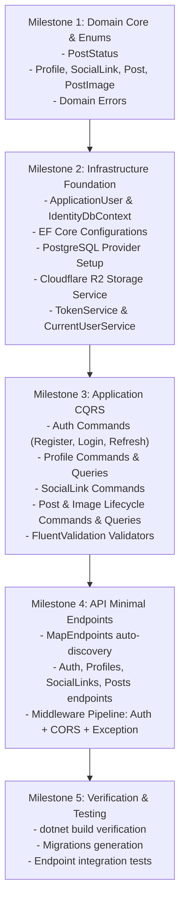

# Backend Technical Implementation Plan: Showcase Portfolio Platform

Comprehensive, production-ready backend implementation plan for the **Showcase Portfolio Platform** adhering to Clean Architecture, Pragmatic DDD (YAGNI), .NET 10, C# 14, CQRS with MediatR, ASP.NET Core Identity with JWT & Refresh Tokens, PostgreSQL with EF Core, and Cloudflare R2 object storage.

---

## 1. Architecture Overview & High-Level Design

The backend strictly implements the 4-layer inward Clean Architecture specified in [README.md](file:///d:/Projects/AspFiles/Showcase/README.md) and governed by the `.gemini/skills`:

```
┌─────────────────────────────────────────────────────────────┐
│                       Showcase.Api                          │
│     (Minimal APIs, IEndpoint Auto-Discovery, Results)       │
└───────────────┬─────────────────────────────┬───────────────┘
                │                             │
                ▼                             ▼
┌──────────────────────────────┐ ┌────────────────────────────┐
│    Showcase.Application      │ │   Showcase.Infrastructure  │
│  (CQRS, MediatR, Validators) │ │ (EF Core, Identity, R2 S3) │
└───────────────┬──────────────┘ └────────────┬───────────────┘
                │                             │
                ▼                             ▼
┌─────────────────────────────────────────────────────────────┐
│                      Showcase.Domain                        │
│                (Pure C# - Zero Dependencies)                │
│    Profile, SocialLink, Post, PostImage, Domain Errors      │
└─────────────────────────────────────────────────────────────┘
```

### Key Technical Decisions:

1. **Zero Social Network Bloat**: Explicitly excludes likes, comments, follower graphs, notifications, and complex feed algorithms as mandated by [showcase_portfolio_platform_specification.md](file:///d:/Projects/AspFiles/Showcase/showcase_portfolio_platform_specification.md).
2. **Result Pattern Everywhere**: No business logic exceptions. Control flow uses `Result` and `Result<T>` with strongly typed domain errors (`Error.NotFound`, `Error.Validation`, `Error.Conflict`, `Error.Unauthorized`, `Error.Forbidden`), converted to RFC 7807 ProblemDetails via `result.ToResponse()`.
3. **Pure Domain Core**: Zero NuGet packages or third-party dependencies in `Showcase.Domain`.
4. **Relational Database**: PostgreSQL via `Npgsql.EntityFrameworkCore.PostgreSQL`.
5. **Decoupled Image Storage**: Cloudflare R2 via AWS S3 SDK (`AWSSDK.S3`). Database only stores storage keys (`AvatarKey`, `StorageKey`), while client direct-uploads via presigned URLs.
6. **Identity & Auth**: ASP.NET Core Identity in `Showcase.Infrastructure` with stateless JWT access tokens and rotatable refresh tokens stored on `ApplicationUser`.

---

## 2. User Review Required

> [!IMPORTANT]
> **Database Provider Confirmation**: The starter template in [README.md](file:///d:/Projects/AspFiles/Showcase/README.md) mentions SQL Server as default, but the product specification in [showcase_portfolio_platform_specification.md](file:///d:/Projects/AspFiles/Showcase/showcase_portfolio_platform_specification.md) explicitly specifies **PostgreSQL**. This plan configures PostgreSQL (`Npgsql.EntityFrameworkCore.PostgreSQL`) with connection strings in `appsettings.json`.

> [!IMPORTANT]
> **Cloudflare R2 Direct Upload Strategy**: To keep backend CPU/bandwidth zero-overhead and secure, image uploading uses presigned `PUT` URLs generated by `IStorageService`. The client requests a presigned URL, uploads directly to R2, and then confirms/attaches the image key via backend command.

---

## 3. Open Questions

> [!NOTE]
> None blocking. The profile will be automatically provisioned upon successful registration with initial first/last name and username derived from email or provided during registration.

---

## 4. Proposed Changes Layer-by-Layer

---

### Layer 1: `Showcase.Domain` (Pure Business Core)

`Showcase.Domain` has zero package references. All entities inherit from `BaseEntity` (Guid Id) with private setters, constructor invariant validation, and rich domain behavior.

#### [NEW] [PostStatus.cs](file:///d:/Projects/AspFiles/Showcase/Showcase.Domain/Enums/PostStatus.cs)

```csharp
namespace Showcase.Domain.Enums;

public enum PostStatus
{
    Draft = 0,
    Published = 1,
    Unpublished = 2
}
```

#### [NEW] [Profile.cs](file:///d:/Projects/AspFiles/Showcase/Showcase.Domain/Entities/Profile.cs)

- **Properties**:
  - `Guid Id` (from `BaseEntity`)
  - `string UserId` (Reference to Identity user)
  - `string Username` (Unique slug, e.g. `john`)
  - `string FirstName`
  - `string LastName`
  - `string? Bio`
  - `string? AvatarKey` (Cloudflare R2 storage key)
  - `DateTime CreatedAt`
  - `DateTime? UpdatedAt`
  - `IReadOnlyCollection<SocialLink> SocialLinks`
  - `IReadOnlyCollection<Post> Posts`
- **Domain Methods**:
  - `UpdateDetails(string firstName, string lastName, string? bio)`
  - `SetUsername(string username)`
  - `SetAvatar(string avatarKey)`
  - `RemoveAvatar()`

#### [NEW] [ProfileErrors.cs](file:///d:/Projects/AspFiles/Showcase/Showcase.Domain/Entities/ProfileErrors.cs)

- `NotFound(Guid id)` -> 404
- `NotFoundByUsername(string username)` -> 404
- `UsernameTaken(string username)` -> 409
- `InvalidUsername` -> 400
- `UnauthorizedAccess` -> 403

#### [NEW] [SocialLink.cs](file:///d:/Projects/AspFiles/Showcase/Showcase.Domain/Entities/SocialLink.cs)

- **Properties**:
  - `Guid Id` (from `BaseEntity`)
  - `Guid ProfileId`
  - `string Platform` (e.g., GitHub, LinkedIn, Behance, Custom)
  - `string Url`
  - `int DisplayOrder`
  - `Profile Profile` (navigation)
- **Domain Methods**:
  - `Update(string platform, string url, int displayOrder)`
  - `SetDisplayOrder(int displayOrder)`

#### [NEW] [SocialLinkErrors.cs](file:///d:/Projects/AspFiles/Showcase/Showcase.Domain/Entities/SocialLinkErrors.cs)

- `NotFound(Guid id)` -> 404
- `InvalidUrl` -> 400

#### [NEW] [Post.cs](file:///d:/Projects/AspFiles/Showcase/Showcase.Domain/Entities/Post.cs)

- **Properties**:
  - `Guid Id` (from `BaseEntity`)
  - `Guid ProfileId`
  - `string Title`
  - `string Description`
  - `string? ExternalUrl`
  - `PostStatus Status` (`Draft`, `Published`, `Unpublished`)
  - `DateTime CreatedAt`
  - `DateTime? PublishedAt`
  - `DateTime? UpdatedAt`
  - `Profile Profile` (navigation)
  - `IReadOnlyCollection<PostImage> Images`
- **Domain Methods**:
  - `UpdateDetails(string title, string description, string? externalUrl)`
  - `Publish()` (Sets `Status = PostStatus.Published`, `PublishedAt = DateTime.UtcNow`)
  - `Unpublish()` (Sets `Status = PostStatus.Unpublished`)
  - `AddImage(string storageKey, int displayOrder)`
  - `RemoveImage(Guid imageId)`
  - `ReorderImages(Dictionary<Guid, int> orderings)`

#### [NEW] [PostErrors.cs](file:///d:/Projects/AspFiles/Showcase/Showcase.Domain/Entities/PostErrors.cs)

- `NotFound(Guid id)` -> 404
- `CannotPublishEmptyPost` -> 400 (Must have at least one image to publish)
- `UnauthorizedAccess` -> 403
- `InvalidStatusTransition` -> 400

#### [NEW] [PostImage.cs](file:///d:/Projects/AspFiles/Showcase/Showcase.Domain/Entities/PostImage.cs)

- **Properties**:
  - `Guid Id` (from `BaseEntity`)
  - `Guid PostId`
  - `string StorageKey` (Cloudflare R2 object key)
  - `int DisplayOrder`
  - `DateTime CreatedAt`
  - `Post Post` (navigation)
- **Domain Methods**:
  - `SetDisplayOrder(int displayOrder)`

#### [NEW] [PostImageErrors.cs](file:///d:/Projects/AspFiles/Showcase/Showcase.Domain/Entities/PostImageErrors.cs)

- `NotFound(Guid id)` -> 404

---

### Layer 2: `Showcase.Application` (CQRS Features & Business Orchestration)

Depends on `Showcase.Domain` only. Employs MediatR 14.2.0, FluentValidation 12.1.1, and EF Core abstractions.

#### Interfaces & Core Contracts

#### [NEW] [ITokenService.cs](file:///d:/Projects/AspFiles/Showcase/Showcase.Application/Common/Interfaces/ITokenService.cs)

```csharp
public interface ITokenService
{
    string GenerateAccessToken(string userId, string email, IList<string> roles);
    string GenerateRefreshToken();
    ClaimsPrincipal? GetPrincipalFromExpiredToken(string token);
}
```

#### [NEW] [ICurrentUserService.cs](file:///d:/Projects/AspFiles/Showcase/Showcase.Application/Common/Interfaces/ICurrentUserService.cs)

```csharp
public interface ICurrentUserService
{
    string? UserId { get; }
    string? Email { get; }
    bool IsAuthenticated { get; }
}
```

#### [NEW] [IStorageService.cs](file:///d:/Projects/AspFiles/Showcase/Showcase.Application/Common/Interfaces/IStorageService.cs)

```csharp
public interface IStorageService
{
    Task<string> GetPresignedUploadUrlAsync(string storageKey, string contentType, TimeSpan expiresIn, CancellationToken ct = default);
    string GetPublicUrl(string storageKey);
    Task DeleteAsync(string storageKey, CancellationToken ct = default);
}
```

---

#### Features & Vertical Slices

#### 1. Auth Feature (`Showcase.Application/Features/Auth/`)

- **Commands/Register**:
  - `RegisterCommand(string Email, string Password, string Username, string FirstName, string LastName) : IRequest<Result<AuthResponse>>`
  - `RegisterCommandValidator`: Enforce email format, strong password, valid alphanumeric username.
  - `RegisterCommandHandler`: Uses `UserManager<ApplicationUser>` to create identity user, auto-creates associated `Profile`, returns `AuthResponse(AccessToken, RefreshToken)`.
- **Commands/Login**:
  - `LoginCommand(string Email, string Password) : IRequest<Result<AuthResponse>>`
  - `LoginCommandHandler`: Validates user credentials, returns fresh access + refresh tokens.
- **Commands/RefreshToken**:
  - `RefreshTokenCommand(string AccessToken, string RefreshToken) : IRequest<Result<AuthResponse>>`
  - `RefreshTokenCommandHandler`: Validates expired principal, checks stored refresh token and expiry, rotates refresh token.
- **Queries/GetCurrentUser**:
  - `GetCurrentUserQuery() : IRequest<Result<CurrentUserResponse>>`
  - `CurrentUserResponse(string Id, string Email, string FirstName, string LastName, string Username, Guid ProfileId, string? AvatarUrl)`

#### 2. Profiles Feature (`Showcase.Application/Features/Profiles/`)

- **Commands/UpdateProfile**:
  - `UpdateProfileCommand(string FirstName, string LastName, string? Bio) : IRequest<Result>`
  - `UpdateProfileCommandValidator`: Bio max length 500, First/Last name required.
  - `UpdateProfileCommandHandler`: Validates current user's profile ownership, updates details.
- **Commands/GetAvatarUploadUrl**:
  - `GetAvatarUploadUrlCommand(string ContentType, long FileSizeBytes) : IRequest<Result<UploadUrlResponse>>`
  - `GetAvatarUploadUrlCommandHandler`: Validates image MIME type (`image/jpeg`, `image/png`, `image/webp`), limits size <= 5MB, generates storage key `avatars/{profileId}/{guid}.ext`, returns presigned PUT URL and storage key.
- **Commands/UpdateAvatar**:
  - `UpdateAvatarCommand(string StorageKey) : IRequest<Result>`
  - `UpdateAvatarCommandHandler`: Confirms avatar key on Profile, marks updated.
- **Queries/GetMyProfile**:
  - `GetMyProfileQuery() : IRequest<Result<MyProfileResponse>>`
  - `MyProfileResponse(Guid Id, string Username, string FirstName, string LastName, string? Bio, string? AvatarUrl, List<SocialLinkResponse> SocialLinks)`
- **Queries/GetPublicProfile**:
  - `GetPublicProfileQuery(string Username) : IRequest<Result<PublicProfileResponse>>`
  - `PublicProfileResponse(Guid Id, string Username, string FirstName, string LastName, string? Bio, string? AvatarUrl, List<SocialLinkResponse> SocialLinks, List<PublicPostSummaryResponse> PublishedPosts)`
  - _Public visitors only see published posts! Drafts and unpublished posts are excluded._

#### 3. SocialLinks Feature (`Showcase.Application/Features/SocialLinks/`)

- **Commands/AddSocialLink**:
  - `AddSocialLinkCommand(string Platform, string Url, int DisplayOrder) : IRequest<Result<Guid>>`
  - `AddSocialLinkCommandValidator`: Valid URI format, max platform length 50.
  - `AddSocialLinkCommandHandler`: Adds `SocialLink` attached to the caller's profile.
- **Commands/UpdateSocialLink**:
  - `UpdateSocialLinkCommand(Guid Id, string Platform, string Url, int DisplayOrder) : IRequest<Result>`
- **Commands/DeleteSocialLink**:
  - `DeleteSocialLinkCommand(Guid Id) : IRequest<Result>`
- **Commands/ReorderSocialLinks**:
  - `ReorderSocialLinksCommand(List<SocialLinkOrderItem> Items) : IRequest<Result>`
  - `SocialLinkOrderItem(Guid Id, int DisplayOrder)`

#### 4. Posts Feature (`Showcase.Application/Features/Posts/`)

- **Commands/CreatePost**:
  - `CreatePostCommand(string Title, string Description, string? ExternalUrl) : IRequest<Result<Guid>>`
  - `CreatePostCommandValidator`: Title required (max 150), description max 2000, valid external URL if provided.
  - `CreatePostCommandHandler`: Instantiates new `Post` in `Draft` status for caller's profile.
- **Commands/UpdatePost**:
  - `UpdatePostCommand(Guid Id, string Title, string Description, string? ExternalUrl) : IRequest<Result>`
  - Checks profile ownership.
- **Commands/PublishPost**:
  - `PublishPostCommand(Guid Id) : IRequest<Result>`
  - Ensures caller owns post and post has >= 1 image. Transitions to `Published`.
- **Commands/UnpublishPost**:
  - `UnpublishPostCommand(Guid Id) : IRequest<Result>`
  - Transitions to `Unpublished`.
- **Commands/DeletePost**:
  - `DeletePostCommand(Guid Id) : IRequest<Result>`
  - Removes post, images, and schedules R2 deletion.
- **Commands/GetPostImageUploadUrl**:
  - `GetPostImageUploadUrlCommand(Guid PostId, string ContentType, long FileSizeBytes) : IRequest<Result<UploadUrlResponse>>`
  - Validates post ownership, validates image content type and max size (e.g. 15MB), generates storage key `posts/{postId}/{guid}.ext`, returns presigned PUT URL.
- **Commands/AddPostImage**:
  - `AddPostImageCommand(Guid PostId, string StorageKey, int DisplayOrder) : IRequest<Result<Guid>>`
  - Attaches `PostImage` to post.
- **Commands/RemovePostImage**:
  - `RemovePostImageCommand(Guid PostId, Guid ImageId) : IRequest<Result>`
- **Commands/ReorderPostImages**:
  - `ReorderPostImagesCommand(Guid PostId, List<PostImageOrderItem> Items) : IRequest<Result>`
- **Queries/GetPostById**:
  - `GetPostByIdQuery(Guid Id) : IRequest<Result<PostDetailResponse>>`
  - If published: returns publicly. If draft/unpublished: allowed ONLY if caller is post creator.
- **Queries/GetMyPosts**:
  - `GetMyPostsQuery(int PageNumber = 1, int PageSize = 12, PostStatus? Status = null) : IRequest<Result<PaginatedList<MyPostSummaryResponse>>>`
  - Allows creator to filter by status (all, drafts, published, unpublished).
- **Queries/GetExplorePosts**:
  - `GetExplorePostsQuery(int PageNumber = 1, int PageSize = 12, string? Search = null) : IRequest<Result<PaginatedList<ExplorePostResponse>>>`
  - Returns publicly published posts ordered by `PublishedAt DESC`. Basic title/description keyword search.
- **Queries/GetProfilePosts**:
  - `GetProfilePostsQuery(string Username, int PageNumber = 1, int PageSize = 12) : IRequest<Result<PaginatedList<ExplorePostResponse>>>`
  - Paginated published work for a specific creator.

---

### Layer 3: `Showcase.Infrastructure` (Data, Identity & External Storage)

Depends on `Showcase.Application` and `Showcase.Domain`.

#### Identity & Authentication

#### [NEW] [ApplicationUser.cs](file:///d:/Projects/AspFiles/Showcase/Showcase.Infrastructure/Identity/ApplicationUser.cs)

```csharp
public class ApplicationUser : IdentityUser
{
    public string FirstName { get; set; } = string.Empty;
    public string LastName { get; set; } = string.Empty;
    public string? RefreshToken { get; set; }
    public DateTime? RefreshTokenExpiryTime { get; set; }
    public Guid ProfileId { get; set; }
}
```

#### [NEW] [JwtSettings.cs](file:///d:/Projects/AspFiles/Showcase/Showcase.Infrastructure/Identity/JwtSettings.cs)

- Options class for section `"JwtSettings"`: `Secret`, `Issuer`, `Audience`, `ExpiryMinutes`.

#### [NEW] [TokenService.cs](file:///d:/Projects/AspFiles/Showcase/Showcase.Infrastructure/Identity/TokenService.cs)

- Implements `ITokenService`: JWT creation with `HmacSha256`, refresh token cryptographic generator, `GetPrincipalFromExpiredToken` without lifetime validation.

#### [NEW] [CurrentUserService.cs](file:///d:/Projects/AspFiles/Showcase/Showcase.Infrastructure/Identity/CurrentUserService.cs)

- Implements `ICurrentUserService` using `IHttpContextAccessor` to extract `ClaimTypes.NameIdentifier` and `ClaimTypes.Email`.

---

#### Cloudflare R2 Object Storage

#### [NEW] [R2Settings.cs](file:///d:/Projects/AspFiles/Showcase/Showcase.Infrastructure/Storage/R2Settings.cs)

```csharp
public class R2Settings
{
    public const string SectionName = "CloudflareR2";
    public string AccountId { get; init; } = string.Empty;
    public string AccessKeyId { get; init; } = string.Empty;
    public string SecretAccessKey { get; init; } = string.Empty;
    public string BucketName { get; init; } = string.Empty;
    public string PublicUrlPrefix { get; init; } = string.Empty; // e.g. https://cdn.showcase.com or R2 public bucket URL
}
```

#### [NEW] [CloudflareR2StorageService.cs](file:///d:/Projects/AspFiles/Showcase/Showcase.Infrastructure/Storage/CloudflareR2StorageService.cs)

- Implements `IStorageService` using `AWSSDK.S3`:
  - Configures `AmazonS3Client` with ServiceURL `https://{AccountId}.r2.cloudflarestorage.com`.
  - `GetPresignedUploadUrlAsync`: Calls `s3Client.GetPreSignedURLAsync(new GetPreSignedUrlRequest { Verb = HttpVerb.PUT, Expires = ..., ContentType = ... })`.
  - `GetPublicUrl`: Combines `PublicUrlPrefix` with `storageKey`.
  - `DeleteAsync`: Calls `s3Client.DeleteObjectAsync(...)`.

---

#### Persistence & EF Core (PostgreSQL)

#### [MODIFY] [ApplicationDbContext.cs](file:///d:/Projects/AspFiles/Showcase/Showcase.Infrastructure/Data/ApplicationDbContext.cs)

```csharp
public class ApplicationDbContext : IdentityDbContext<ApplicationUser>, IApplicationDbContext
{
    public ApplicationDbContext(DbContextOptions<ApplicationDbContext> options) : base(options) { }

    public DbSet<Profile> Profiles => Set<Profile>();
    public DbSet<SocialLink> SocialLinks => Set<SocialLink>();
    public DbSet<Post> Posts => Set<Post>();
    public DbSet<PostImage> PostImages => Set<PostImage>();

    protected override void OnModelCreating(ModelBuilder modelBuilder)
    {
        base.OnModelCreating(modelBuilder);
        modelBuilder.ApplyConfigurationsFromAssembly(typeof(ApplicationDbContext).Assembly);
    }
}
```

#### [NEW] [ProfileConfiguration.cs](file:///d:/Projects/AspFiles/Showcase/Showcase.Infrastructure/Data/Configurations/ProfileConfiguration.cs)

- `HasKey(p => p.Id)`
- `HasIndex(p => p.Username).IsUnique()`
- `HasIndex(p => p.UserId).IsUnique()`
- `Property(p => p.FirstName).HasMaxLength(100).IsRequired()`
- `Property(p => p.LastName).HasMaxLength(100).IsRequired()`
- `Property(p => p.Username).HasMaxLength(50).IsRequired()`
- `Property(p => p.Bio).HasMaxLength(500)`
- `Property(p => p.AvatarKey).HasMaxLength(300)`
- Navigation relationships to `SocialLinks` (Cascade delete) and `Posts` (Cascade delete).

#### [NEW] [SocialLinkConfiguration.cs](file:///d:/Projects/AspFiles/Showcase/Showcase.Infrastructure/Data/Configurations/SocialLinkConfiguration.cs)

- `HasKey(s => s.Id)`
- `Property(s => s.Platform).HasMaxLength(50).IsRequired()`
- `Property(s => s.Url).HasMaxLength(500).IsRequired()`
- `HasOne(s => s.Profile).WithMany(p => p.SocialLinks).HasForeignKey(s => s.ProfileId)`

#### [NEW] [PostConfiguration.cs](file:///d:/Projects/AspFiles/Showcase/Showcase.Infrastructure/Data/Configurations/PostConfiguration.cs)

- `HasKey(p => p.Id)`
- `Property(p => p.Title).HasMaxLength(150).IsRequired()`
- `Property(p => p.Description).HasMaxLength(2000).IsRequired()`
- `Property(p => p.ExternalUrl).HasMaxLength(500)`
- `HasIndex(p => p.Status)`
- `HasIndex(p => p.PublishedAt)`
- `HasOne(p => p.Profile).WithMany(pr => pr.Posts).HasForeignKey(p => p.ProfileId)`
- Navigation relationship to `PostImages` (Cascade delete).

#### [NEW] [PostImageConfiguration.cs](file:///d:/Projects/AspFiles/Showcase/Showcase.Infrastructure/Data/Configurations/PostImageConfiguration.cs)

- `HasKey(pi => pi.Id)`
- `Property(pi => pi.StorageKey).HasMaxLength(300).IsRequired()`
- `HasOne(pi => pi.Post).WithMany(p => p.Images).HasForeignKey(pi => pi.PostId)`

#### [MODIFY] [DependencyInjection.cs](file:///d:/Projects/AspFiles/Showcase/Showcase.Infrastructure/DependencyInjection/DependencyInjection.cs)

- Registers:
  - `Npgsql.EntityFrameworkCore.PostgreSQL` DbContext connection.
  - ASP.NET Core Identity with `AddIdentity<ApplicationUser, IdentityRole>()`.
  - JWT Bearer Authentication & Authorization policies.
  - `ITokenService` -> `TokenService`.
  - `ICurrentUserService` -> `CurrentUserService`.
  - `IStorageService` -> `CloudflareR2StorageService`.
  - `IHttpContextAccessor`.

---

### Layer 4: `Showcase.Api` (Minimal APIs & Auto-Discovery)

Every endpoint class implements `IEndpoint` with auto-registration through `app.MapEndpoints()`. Responses use `.ToResponse()` mapping Result/Error to RFC 7807 ProblemDetails.

#### Endpoint Route Map:

| Group           | Method   | Path                                         | Auth           | Description                               |
| --------------- | -------- | -------------------------------------------- | -------------- | ----------------------------------------- |
| **Auth**        | `POST`   | `/api/auth/register`                         | Anonymous      | Register account & create profile         |
| **Auth**        | `POST`   | `/api/auth/login`                            | Anonymous      | Login & obtain JWT pair                   |
| **Auth**        | `POST`   | `/api/auth/refresh`                          | Anonymous      | Rotate refresh token                      |
| **Auth**        | `GET`    | `/api/auth/me`                               | Authorized     | Current user info & session               |
| **Profiles**    | `GET`    | `/api/profiles/me`                           | Authorized     | Get caller's own profile                  |
| **Profiles**    | `PUT`    | `/api/profiles/me`                           | Authorized     | Update name and bio                       |
| **Profiles**    | `POST`   | `/api/profiles/me/avatar/upload-url`         | Authorized     | Request presigned avatar upload URL       |
| **Profiles**    | `PUT`    | `/api/profiles/me/avatar`                    | Authorized     | Confirm and set new avatar key            |
| **Profiles**    | `GET`    | `/api/profiles/{username}`                   | Anonymous      | Public portfolio profile                  |
| **Profiles**    | `GET`    | `/api/profiles/{username}/posts`             | Anonymous      | Public published posts by creator         |
| **SocialLinks** | `POST`   | `/api/profiles/me/social-links`              | Authorized     | Add external social link                  |
| **SocialLinks** | `PUT`    | `/api/profiles/me/social-links/{id:guid}`    | Authorized     | Update social link                        |
| **SocialLinks** | `DELETE` | `/api/profiles/me/social-links/{id:guid}`    | Authorized     | Delete social link                        |
| **SocialLinks** | `PUT`    | `/api/profiles/me/social-links/reorder`      | Authorized     | Reorder social links                      |
| **Posts**       | `POST`   | `/api/posts`                                 | Authorized     | Create new post (starts Draft)            |
| **Posts**       | `PUT`    | `/api/posts/{id:guid}`                       | Authorized     | Update post title, desc, url              |
| **Posts**       | `DELETE` | `/api/posts/{id:guid}`                       | Authorized     | Delete post and images                    |
| **Posts**       | `POST`   | `/api/posts/{id:guid}/publish`               | Authorized     | Publish post                              |
| **Posts**       | `POST`   | `/api/posts/{id:guid}/unpublish`             | Authorized     | Unpublish post                            |
| **Posts**       | `POST`   | `/api/posts/{id:guid}/images/upload-url`     | Authorized     | Request presigned post image upload URL   |
| **Posts**       | `POST`   | `/api/posts/{id:guid}/images`                | Authorized     | Attach uploaded image to post             |
| **Posts**       | `DELETE` | `/api/posts/{id:guid}/images/{imageId:guid}` | Authorized     | Remove image from post                    |
| **Posts**       | `PUT`    | `/api/posts/{id:guid}/images/reorder`        | Authorized     | Reorder images within post                |
| **Posts**       | `GET`    | `/api/posts/mine`                            | Authorized     | Creator's posts (drafts, published, etc.) |
| **Posts**       | `GET`    | `/api/posts/{id:guid}`                       | Anonymous/Auth | View single post (public or creator)      |
| **Posts**       | `GET`    | `/api/posts/explore`                         | Anonymous      | Public explore feed (paginated, search)   |

#### [MODIFY] [Program.cs](file:///d:/Projects/AspFiles/Showcase/Showcase.Api/Program.cs)

Ensure correct middleware pipeline order:

```csharp
app.UseExceptionHandler();
app.UseAuthentication();
app.UseAuthorization();
app.UseHttpsRedirection();
app.UseCors("AllowAll");
app.MapEndpoints();
```

#### [MODIFY] [appsettings.json](file:///d:/Projects/AspFiles/Showcase/Showcase.Api/appsettings.json)

Configure:

- `ConnectionStrings:DefaultConnection` (PostgreSQL)
- `JwtSettings`
- `CloudflareR2`

---

## 5. Implementation Phases & Milestones



---

## 6. Verification Plan

### Automated Build & Compilation

- Build solution in Release configuration:
  ```powershell
  dotnet build Showcase.slnx --configuration Release
  ```
- Verify zero warnings or errors across all 4 projects.

### Database Migrations Verification

- Add EF Core initial migration:
  ```powershell
  dotnet ef migrations add InitialShowcaseSchema --project Showcase.Infrastructure --startup-project Showcase.Api
  ```

### Manual & API Verification

- Execute `.http` request test file (`Showcase.Api.http`) covering:
  1. `POST /api/auth/register` -> Verify 200 OK + JWT access & refresh tokens returned.
  2. `POST /api/auth/login` -> Verify 200 OK.
  3. `GET /api/profiles/me` -> Verify caller profile matches registration data.
  4. `POST /api/profiles/me/social-links` -> Add GitHub and LinkedIn links.
  5. `POST /api/posts` -> Create draft post.
  6. `POST /api/posts/{id}/images/upload-url` -> Verify presigned R2 URL generation.
  7. `POST /api/posts/{id}/images` -> Attach image key to post.
  8. `POST /api/posts/{id}/publish` -> Publish post.
  9. `GET /api/posts/explore` -> Verify published post appears in public explore feed.
  10. `GET /api/profiles/{username}` -> Verify public visitor can view creator profile, social links, and published showcase work.
