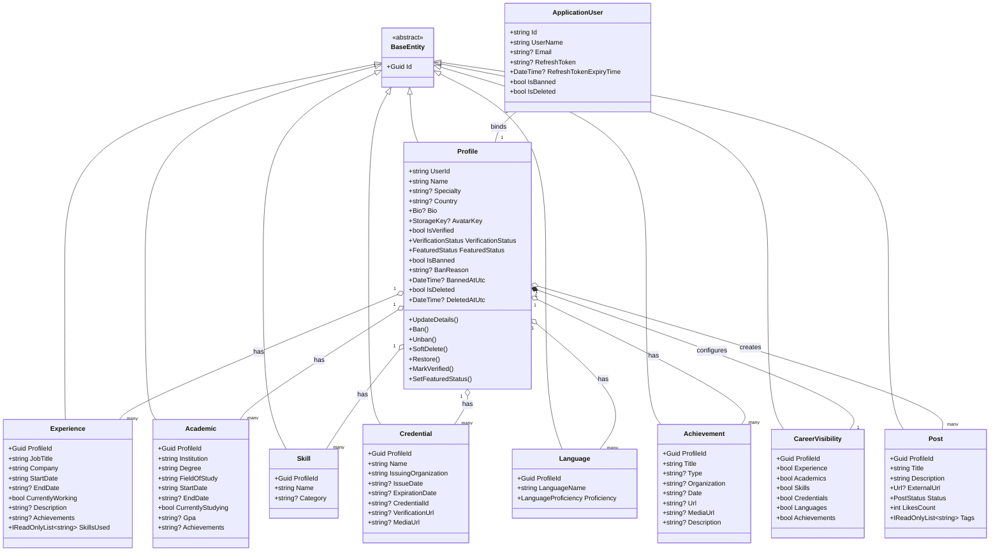

# Updated Domain Architecture & Entity Model Report — Pority Platform

> **التحديثات المعتمدة من صاحب المشروع:**
> 1. توحيد الاسم في حقل واحد `Name` بدلاً من `FirstName` و `LastName`.
> 2. جعل البريد الإلكتروني `Email` حقلاً اختيارياً (التسجيل والتعريف الأساسي يتم عبر `Username`).
> 3. جعل التخصص `Specialty` حقلاً اختيارياً.
> 4. إضافة حقل الدولة `Country` كحقل اختياري (غير مطلوب عند التسجيل، تمهيداً لقائمة دول لاحقاً).
> 5. إضافة منظومة حظر وتجميد الحسابات (`IsBanned`, `BanReason`, `BannedAtUtc`) بجانب الحذف الناعم (`IsDeleted`, `DeletedAtUtc`).

---

## 1. جدول الحقول المحدثة بعد التعديل (Updated Field Constraints)

### 1.1 الهوية والملف الشخصي (`Profile` & `Identity`)

| الحقل | الحالة | النوع والقيود | الوصف والدور |
|---|---|---|---|
| `Username` | **إلزامي (Required)** | نص فريد، أحرف إنجليزية وأرقام، لا فراغات | المعرف الأساسي لحساب الدخول والرابط العام `/u/{username}` |
| `Name` | **إلزامي (Required)** | نص (1–150 حرف) | الاسم الكامل الموحد لصاحب الحساب |
| `Email` | **اختياري (Optional)** | صيغة بريد إلكتروني (إن وُجد) | للتواصل واستعادة الحساب اختياري |
| `Country` | **اختياري (Optional)** | نص (مثل: "Jordan", "Saudi Arabia") | بلد الإقامة/النشاط |
| `Specialty` | **اختياري (Optional)** | نص (حتى 100 حرف) | التخصص المهني (مثل: "Architect", "UI/UX Designer") |
| `Bio` | **اختياري (Optional)** | كائن قيمة `Bio` (حتى 1000 حرف) | نبذة تعريفية بالملف الشخصي |
| `AvatarKey` | **اختياري (Optional)** | كائن قيمة `StorageKey` | مفتاح/رابط الصورة الشخصية |
| `IsVerified` | يدار بالنظام | Boolean (افتراضي false) | شارة التوثيق الزرقاء |
| `VerificationStatus` | يدار بالنظام | Enum: `none`, `pending`, `verified`, `rejected` | مسار مراجعة طلب التوثيق |
| `FeaturedStatus` | يدار بالنظام | Enum: `none`, `pending`, `featured`, `rejected` | مسار الظهور في الـ Feed |
| `IsBanned` | يدار بالأدمن | Boolean (افتراضي false) | حالة الحظر/التجميد الإداري |
| `BanReason` | يدار بالأدمن | نص اختياري | سبب حظر الحساب |
| `BannedAtUtc` | يدار بالأدمن | DateTime? | تاريخ ووقت الحظر |
| `IsDeleted` | يدار بالنظام | Boolean (افتراضي false) | الحذف الناعم بواسطة المستخدم |
| `DeletedAtUtc` | يدار بالنظام | DateTime? | تاريخ ووقت الحذف |

---

## 2. هيكل كلاس `Profile` في `Showcase.Domain` (DDD Implementation)

وفقاً لإرشادات `ddd-guide` و `domain-layer`:
- الوراثة من `BaseEntity` (Guid Id).
- الخصائص بـ **Private Setters** لحماية الـ Invariants.
- دوال سلوكية صريحة (Behavior Methods) لإجراء التعديلات والحظر وإلغاء الحظر.

```csharp
namespace Showcase.Domain.Entities;

public class Profile : BaseEntity
{
    private readonly List<SocialLink> _socialLinks = new();

    public string UserId { get; private set; } = string.Empty;
    public string Name { get; private set; } = string.Empty;
    public string? Specialty { get; private set; }
    public string? Country { get; private set; }
    public Bio? Bio { get; private set; }
    public StorageKey? AvatarKey { get; private set; }

    // Verification & Discovery
    public bool IsVerified { get; private set; }
    public VerificationStatus VerificationStatus { get; private set; }
    public FeaturedStatus FeaturedStatus { get; private set; }

    // Moderation & Lifecycle
    public bool IsBanned { get; private set; }
    public string? BanReason { get; private set; }
    public DateTime? BannedAtUtc { get; private set; }

    public bool IsDeleted { get; private set; }
    public DateTime? DeletedAtUtc { get; private set; }

    public DateTime CreatedAt { get; private set; }
    public DateTime? UpdatedAt { get; private set; }

    public IReadOnlyCollection<SocialLink> SocialLinks => _socialLinks.AsReadOnly();

    private Profile() { } // EF Core

    public Profile(string userId, string name, string? specialty = null, string? country = null, Bio? bio = null, StorageKey? avatarKey = null)
    {
        if (string.IsNullOrWhiteSpace(userId))
            throw new ArgumentException("UserId is required.", nameof(userId));

        if (string.IsNullOrWhiteSpace(name))
            throw new ArgumentException("Name is required.", nameof(name));

        UserId = userId;
        Name = name.Trim();
        Specialty = string.IsNullOrWhiteSpace(specialty) ? null : specialty.Trim();
        Country = string.IsNullOrWhiteSpace(country) ? null : country.Trim();
        Bio = bio;
        AvatarKey = avatarKey;
        VerificationStatus = VerificationStatus.None;
        FeaturedStatus = FeaturedStatus.None;
        CreatedAt = DateTime.UtcNow;
    }

    public void UpdateDetails(string name, string? specialty, string? country, Bio? bio)
    {
        if (string.IsNullOrWhiteSpace(name))
            throw new ArgumentException("Name is required.", nameof(name));

        Name = name.Trim();
        Specialty = string.IsNullOrWhiteSpace(specialty) ? null : specialty.Trim();
        Country = string.IsNullOrWhiteSpace(country) ? null : country.Trim();
        Bio = bio;
        UpdatedAt = DateTime.UtcNow;
    }

    public void SetAvatar(StorageKey avatarKey)
    {
        AvatarKey = avatarKey ?? throw new ArgumentNullException(nameof(avatarKey));
        UpdatedAt = DateTime.UtcNow;
    }

    public void RemoveAvatar()
    {
        AvatarKey = null;
        UpdatedAt = DateTime.UtcNow;
    }

    // Moderation Behaviors
    public void Ban(string reason)
    {
        IsBanned = true;
        BanReason = string.IsNullOrWhiteSpace(reason) ? "Violation of platform policies" : reason.Trim();
        BannedAtUtc = DateTime.UtcNow;
        UpdatedAt = DateTime.UtcNow;
    }

    public void Unban()
    {
        IsBanned = false;
        BanReason = null;
        BannedAtUtc = null;
        UpdatedAt = DateTime.UtcNow;
    }

    public void SoftDelete()
    {
        IsDeleted = true;
        DeletedAtUtc = DateTime.UtcNow;
        UpdatedAt = DateTime.UtcNow;
    }

    public void Restore()
    {
        IsDeleted = false;
        DeletedAtUtc = null;
        UpdatedAt = DateTime.UtcNow;
    }

    // Status Transitions
    public void MarkVerified(bool verified = true)
    {
        IsVerified = verified;
        VerificationStatus = verified ? VerificationStatus.Verified : VerificationStatus.None;
        UpdatedAt = DateTime.UtcNow;
    }

    public void SetFeaturedStatus(FeaturedStatus status)
    {
        FeaturedStatus = status;
        UpdatedAt = DateTime.UtcNow;
    }
}
```

---

## 3. الربط مع `ApplicationUser` في `Showcase.Infrastructure`

وفقاً لـ `infrastructure-layer` و `identity-auth`:
- `ApplicationUser` يمتد من `IdentityUser`:
  - `UserName` إلزامي ويستخدم للدخول.
  - `Email` اختياري (يمكن أن يكون null).
  - حقول التوكنات: `RefreshToken`, `RefreshTokenExpiryTime`.
  - حقول الحظر والحذف الناعم متطابقة لمنع الدخول على مستوى المصادقة:
    ```csharp
    public class ApplicationUser : IdentityUser
    {
        public string? RefreshToken { get; set; }
        public DateTime? RefreshTokenExpiryTime { get; set; }

        public bool IsBanned { get; set; }
        public string? BanReason { get; set; }
        public DateTime? BannedAtUtc { get; set; }

        public bool IsDeleted { get; set; }
        public DateTime? DeletedAtUtc { get; set; }

        public Profile Profile { get; set; } = null!;
    }
    ```

### 3.1 فلترة الاستعلامات العامة (Global Query Filters)
في `ApplicationDbContext`:
```csharp
// استبعاد السجلات المحذوفة ناعماً أو المحظورة من الظهور العام تلقائياً
modelBuilder.Entity<Profile>().HasQueryFilter(p => !p.IsDeleted && !p.IsBanned);
modelBuilder.Entity<Post>().HasQueryFilter(p => p.Status == PostStatus.Published);
```
*(ملاحظة: في استعلامات الأدمن يتم استخدام `.IgnoreQueryFilters()` لجلب المستخدمين المحظورين والمحذوفين لإدارتهم وفك حظرهم).*

---

## 4. مخطط الكيانات الكامل المحدث (Updated Class Diagram)



---

## 8. أسباب القرارات والاختلافات المعمارية عن الواجهة الأمامية (Backend vs. Frontend Rationale)

تم اعتماد تعديلات واختلافات معمارية مقصودة ومدروسة في نموذج الباك إند (`Domain` & `Infrastructure`) بالمقارنة مع ما هو موجود حالياً في الواجهة الأمامية (`Showcase.ClientApp`). فيما يلي الأسباب والدوافع الفنية وراء كل قرار:

### 8.1 توحيد الاسم في حقل واحد `Name` بدلاً من (`FirstName`, `LastName`)
- **الدافع وقرار المطور:** الواجهة الأمامية كانت تفصل الاسم إلى حقلين (`firstName` و `lastName`). في منصة للمبدعين والمصممين، يمتلك العديد من المستخدمين أسماء مركبة، أسماء فنية، أو حسابات تمثل استوديوهات إبداعية. تقسيم الاسم يفرض قيوداً لا داعي لها ويزيد من تعقيد شاشات التسجيل والبحث.
- **الإجراء:** تم التوحيد في حقل إلزامي واحد `Name` (حتى 150 حرف) لتبسيط تجربة الاستخدام، وسيتم تعديل شاشات الفرونت لاحقاً لتتوافق مع هذا الحقل الموحد.

### 8.2 جعل البريد الإلكتروني `Email` اختيارياً والاعتماد على `Username` كمعرّف أساسي
- **الدافع وقرار المطور:** في بعض شاشات الفرونت يتم إلزام المستخدم بالبريد. القرار المعتمد هو جعل `Username` هو الهوية الأساسية الفريدة لتسجيل الدخول والوصول للرابط العام (`/u/{username}`)، وذلك لتقليل الاحتكاك عند التسجيل (Frictionless Onboarding).
- **الإجراء:** تم جعل `Email` حقلاً اختيارياً (Nullable)، بحيث يستعمل فقط في حال رغب المستخدم باستخدامه لاستعادة الحساب أو استلام الإشعارات.

### 8.3 جعل التخصص `Specialty` اختيارياً وإضافة حقل الدولة `Country` (وتأجيل الفرونت)
- **الدافع وقرار المطور:** تم إضافة حقل `Country` وجعل `Specialty` اختيارياً في الباك إند، مع اتخاذ قرار صريح بعدم تعديل الفرونت فوراً في هذه المرحلة.
- **السبب:** المطور يخطط لاحقاً لجلب قاعدة بيانات أو ملف JSON مرجعي جاهز يحتوي على قائمة الدول المعيارية والتخصصات المهنية الدقيقة، ليتم عرضها في الواجهة كقوائم منسدلة منسقة ومنظمة (Dropdown Selectors)، بدلاً من ترك المستخدم يكتبها كنصوص حرة غير قياسية قد تشوبها الأخطاء الإملائية.

### 8.4 تطبيع الوسوم بجدول مخصص `Tags` وعلاقة `PostTags` (Many-to-Many) بدلاً من مجرد نصوص
- **الدافع وقرار المطور:** الواجهة الأمامية تتعامل مع الوسوم كعناصر نصية عادية ضمن المنشور (`string[]`). في الباك إند، تم عزلها في جدول مستقل `Tags` مع صيغة بحث موحدة `NormalizedName` وجدول وسيط `PostTags`.
- **السبب:** التمهيد لبناء محرك الاستكشاف والمجتمعات (Community Engine) مستقبلاً، حيث يتيح هذا التصميم فلترة وتجميع الأعمال حسب الوسوم، اقتراح وسوم شائعة (Trending Tags)، وحساب عدد المشاريع المرتبطة بكل وسم بكفاءة عالية على مستوى قاعدة البيانات دون الحاجة لإعادة هيكلة الجداول مستقبلاً.

### 8.5 فصل الحظر الإداري `IsBanned` عن الحذف الناعم `IsDeleted`
- **الدافع وقرار المطور:** التمييز الصريح بين خروج المستخدم بإرادته وبين العقوبة الإدارية:
  - **الحذف الناعم (`IsDeleted`):** يخفي الحساب والمشاريع مع إمكانية قيام الأدمن بالاستعادة.
  - **الحظر (`IsBanned`):** يمنع المستخدم صراحة من تسجيل الدخول ويُظهر له سبب الإيقاف (`BanReason`) وتاريخه، مع إخفاء ملفه تلقائياً عن الزوار عبر الـ Global Query Filter.

